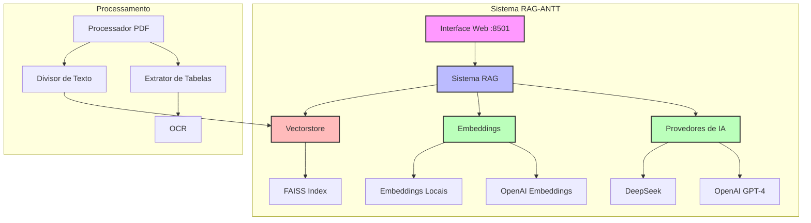
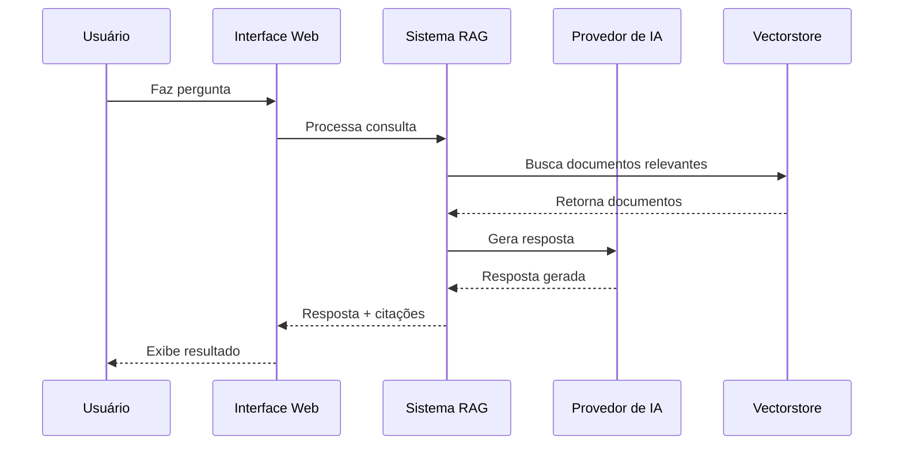
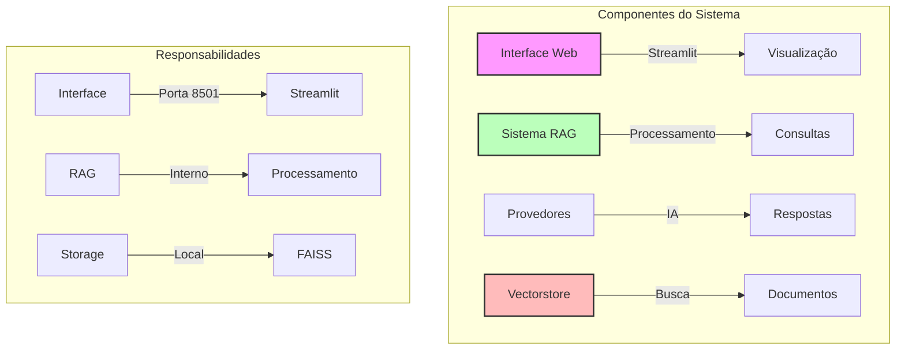

# RAG-ANTT - Sistema de Consulta Inteligente a Documentos

> **Proprietário**: DEEPFEED SOLUTION
> 
> **Uso**: Sistema proprietário para consulta inteligente a documentos da ANTT

Este projeto implementa um sistema RAG (Retrieval-Augmented Generation) para consulta inteligente a documentos da ANTT (Agência Nacional de Transportes Terrestres). O sistema utiliza múltiplos provedores de IA, embeddings locais e uma interface web para fornecer respostas precisas sobre regulamentações de transporte terrestre.

## Índice
- [RAG-ANTT - Sistema de Consulta Inteligente a Documentos](#rag-antt---sistema-de-consulta-inteligente-a-documentos)
  - [Índice](#índice)
  - [Estrutura do Projeto](#estrutura-do-projeto)
  - [Arquitetura da Solução](#arquitetura-da-solução)
    - [Fluxo de Dados](#fluxo-de-dados)
    - [Componentes e Responsabilidades](#componentes-e-responsabilidades)
  - [Pré-requisitos](#pré-requisitos)
    - [Sistema Operacional](#sistema-operacional)
    - [Software](#software)
    - [Recursos do Sistema](#recursos-do-sistema)
  - [Instalação e Execução](#instalação-e-execução)
    - [1. Clone do Repositório](#1-clone-do-repositório)
    - [2. Configuração Inicial](#2-configuração-inicial)
    - [3. Execução](#3-execução)
    - [4. Acesso à Interface Web](#4-acesso-à-interface-web)
  - [Configuração](#configuração)
    - [Variáveis de Ambiente](#variáveis-de-ambiente)
  - [Monitoramento](#monitoramento)
    - [Logs](#logs)
    - [Interface Web](#interface-web)
  - [Integração com Outros Sistemas](#integração-com-outros-sistemas)
    - [API REST](#api-rest)
      - [Endpoints Disponíveis](#endpoints-disponíveis)
      - [Exemplo de Uso com Python](#exemplo-de-uso-com-python)
  - [Troubleshooting](#troubleshooting)
    - [Problemas Comuns](#problemas-comuns)
    - [Solução de Erros](#solução-de-erros)
  - [Contribuição](#contribuição)
  - [Licença](#licença)
    - [Termos de Uso](#termos-de-uso)
  - [Suporte](#suporte)

## Estrutura do Projeto

```
RAG-ANTT/
├── antt_rag_unified.py     # Sistema principal RAG
├── config.py              # Configurações do sistema
├── llm_providers.py       # Gerenciamento de provedores de IA
├── requirements.txt       # Dependências Python
├── criar_vectorstore_deepseek.py  # Script para criar vectorstore
├── gerar_relatorio.py     # Geração de relatórios
├── relatorio_documentos.json  # Relatório de documentos
├── vectorstore/          # Vectorstore OpenAI
├── vectorstore_local/    # Vectorstore local
└── dados_antt/          # Documentos ANTT
```

## Arquitetura da Solução



### Fluxo de Dados



### Componentes e Responsabilidades



## Pré-requisitos

### Sistema Operacional
- Linux (Ubuntu 20.04+)
- macOS (10.15+)
- Windows 10/11 (com WSL2)

### Software
- Python 3.9+
- Tesseract OCR
- Git 2.30+

### Recursos do Sistema
- CPU: 2 cores mínimo
- RAM: 4GB mínimo
- Disco: 10GB livre
- Rede: Conexão estável com internet

## Instalação e Execução

### 1. Clone do Repositório

```bash
# Clone o repositório
git clone https://github.com/seu-usuario/RAG-ANTT.git

# Entre no diretório
cd RAG-ANTT
```

### 2. Configuração Inicial

```bash
# Crie e ative o ambiente virtual
python -m venv venv
source venv/bin/activate  # Linux/macOS
# ou
.\venv\Scripts\activate  # Windows

# Instale as dependências
pip install -r requirements.txt

# Instale o Tesseract OCR
sudo apt-get install tesseract-ocr  # Ubuntu/Debian
# ou
brew install tesseract  # macOS
```

### 3. Execução

```bash
# Execute o sistema
streamlit run antt_rag_unified.py
```

### 4. Acesso à Interface Web

A interface web estará disponível em: `http://localhost:8501`

## Configuração

### Variáveis de Ambiente

O sistema usa as seguintes variáveis de ambiente:

```bash
# Configurações da OpenAI
OPENAI_API_KEY=seu_api_key_aqui

# Configurações do OpenRouter (DeepSeek)
OPENROUTER_API_KEY=seu_api_key_aqui

# Configurações do Sistema
CHUNK_SIZE=500
CHUNK_OVERLAP=150
```

## Monitoramento

### Logs

O sistema utiliza logging para monitoramento:

```python
import logging

# Configuração do logging
logging.basicConfig(
    level=logging.INFO,
    format='%(asctime)s - %(levelname)s - %(message)s'
)
```

### Interface Web

A interface web fornece:
- Consulta a documentos
- Visualização de respostas
- Citações e referências
- Configurações do sistema

## Integração com Outros Sistemas

### API REST

O sistema pode ser integrado via API REST:

#### Endpoints Disponíveis

| Endpoint | Método | Descrição |
|----------|--------|-----------|
| `/api/query` | POST | Realiza consulta |
| `/api/documents` | GET | Lista documentos |
| `/api/status` | GET | Status do sistema |

#### Exemplo de Uso com Python

```python
import requests

class RAGClient:
    def __init__(self, base_url="http://localhost:8501"):
        self.base_url = base_url

    def query(self, question):
        response = requests.post(
            f"{self.base_url}/api/query",
            json={"question": question}
        )
        return response.json()

    def get_documents(self):
        response = requests.get(f"{self.base_url}/api/documents")
        return response.json()
```

## Troubleshooting

### Problemas Comuns

1. **Erro de API Key**
   - Verifique se as variáveis de ambiente estão configuradas
   - Confirme se as chaves são válidas

2. **Erro de Tesseract**
   - Verifique se o Tesseract está instalado
   - Confirme o caminho de instalação

3. **Erro de Memória**
   - Aumente a memória disponível
   - Reduza o tamanho dos chunks

### Solução de Erros

1. **Logs de Erro**
   ```bash
   # Verifique os logs
   tail -f rag_antt.log
   ```

2. **Reinicialização**
   ```bash
   # Pare o processo
   pkill -f streamlit
   
   # Reinicie
   streamlit run antt_rag_unified.py
   ```

## Contribuição

1. Faça um fork do projeto
2. Crie uma branch para sua feature (`git checkout -b feature/nova-feature`)
3. Faça commit das suas alterações (`git commit -m 'feat: adiciona nova feature'`)
4. Faça push para a branch (`git push origin feature/nova-feature`)
5. Abra um Pull Request

## Licença

Este projeto é proprietário da DEEPFEED SOLUTION e seu uso é restrito à consulta de documentos públicos dos órgãos de transporte brasileiros.

### Termos de Uso

- O uso deste software é restrito à DEEPFEED SOLUTION e seus clientes autorizados
- Não é permitida a distribuição, modificação ou uso comercial sem autorização expressa
- Todos os direitos reservados © DEEPFEED SOLUTION

## Suporte

Para suporte, entre em contato:
- Email: romulobrito@deepfeedsolutions.com
- Issues: GitHub Issues
- Documentação: `/docs` 