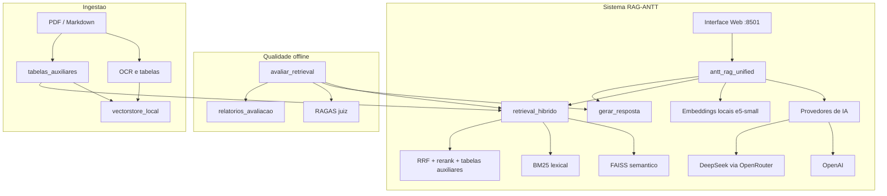
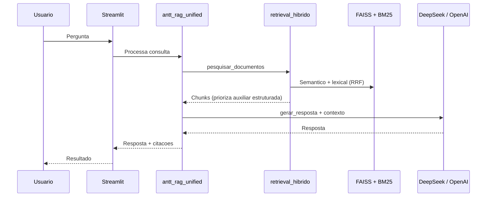

# RAG-ANTT - Sistema de Consulta Inteligente a Documentos

> **Proprietário**: DEEPFEED SOLUTION
> 
> **Uso**: Sistema proprietário para consulta inteligente a documentos da ANTT

Este projeto implementa um sistema RAG (Retrieval-Augmented Generation) para consulta inteligente a documentos da ANTT (Agência Nacional de Transportes Terrestres). O sistema utiliza múltiplos provedores de IA, embeddings locais e uma interface web para fornecer respostas precisas sobre regulamentações de transporte terrestre.

## Índice
- [RAG-ANTT - Sistema de Consulta Inteligente a Documentos](#rag-antt---sistema-de-consulta-inteligente-a-documentos)
  - [Índice](#índice)
  - [Estrutura do Projeto](#estrutura-do-projeto)
  - [Arquitetura da Solução](#arquitetura-da-solução)
    - [Fluxo de Dados](#fluxo-de-dados)
    - [Componentes e Responsabilidades](#componentes-e-responsabilidades)
  - [Avaliacao de Qualidade](#avaliacao-de-qualidade)
  - [Pré-requisitos](#pré-requisitos)
    - [Sistema Operacional](#sistema-operacional)
    - [Software](#software)
    - [Recursos do Sistema](#recursos-do-sistema)
  - [Instalação e Execução](#instalação-e-execução)
    - [1. Clone do Repositório](#1-clone-do-repositório)
    - [2. Configuração Inicial](#2-configuração-inicial)
    - [3. Execução](#3-execução)
    - [4. Acesso à Interface Web](#4-acesso-à-interface-web)
  - [Configuração](#configuração)
    - [Variáveis de Ambiente](#variáveis-de-ambiente)
  - [Monitoramento](#monitoramento)
    - [Logs](#logs)
    - [Interface Web](#interface-web)
  - [Integração com Outros Sistemas](#integração-com-outros-sistemas)
    - [API REST](#api-rest)
      - [Endpoints Disponíveis](#endpoints-disponíveis)
      - [Exemplo de Uso com Python](#exemplo-de-uso-com-python)
      - [Compose local](#compose-local)
  - [Troubleshooting](#troubleshooting)
    - [Problemas Comuns](#problemas-comuns)
    - [Solução de Erros](#solução-de-erros)
  - [Contribuição](#contribuição)
  - [Licença](#licença)
    - [Termos de Uso](#termos-de-uso)
  - [Suporte](#suporte)

## Estrutura do Projeto

```
RAG-ANTT/
├── antt_rag_unified.py          # App Streamlit + pipeline RAG
├── retrieval_hibrido.py         # FAISS + BM25 + RRF + prioridade estruturada
├── llm_providers.py             # LLM (DeepSeek/OpenAI) e embeddings locais
├── config.py                    # Constantes e provedores
├── avaliar_retrieval.py         # Harness: latencia, completude, precisao, RAGAS
├── test_avaliar_retrieval.py
├── test_retrieval_hibrido.py
├── requirements.txt
├── docs/
│   ├── arquitetura_rag_api.tex  # Arquitetura de referencia (API + K8s)
│   └── avaliacao_rag.md         # Guia do harness e metricas
├── dados_antt/
│   ├── ...                      # Normas indexadas (INM, RES, etc.)
│   └── tabelas_auxiliares/      # Transcricoes estruturadas (preferidas ao OCR)
├── vectorstore_local/           # Indice FAISS (embeddings locais)
├── relatorios_avaliacao/        # Saida do harness (md/json)
└── planning/                    # Notas de planejamento (nao operacional)
```

Embedding padrao: `intfloat/multilingual-e5-small` (`LOCAL_EMBEDDING_MODEL` em `config.py`).
Trocar o modelo exige reindexacao completa.

## Arquitetura da Solução



Documentacao de deploy futuro (API FastAPI + Ollama + Rancher): `docs/arquitetura_rag_api.tex`.

### Fluxo de Dados



### Componentes e Responsabilidades

| Componente | Responsabilidade |
|---|---|
| `antt_rag_unified.py` | UI Streamlit, ingestao, OCR, prompts, orquestracao |
| `retrieval_hibrido.py` | Busca hibrida, RRF, expansao por documento-pai, boost de fonte estruturada |
| `llm_providers.py` | ChatOpenAI (OpenRouter/OpenAI) e `LocalEmbeddings` |
| `avaliar_retrieval.py` | Metricas offline (gabarito + latencia + RAGAS opcional) |
| `tipos_documento.py` | Catalogo de tipos gerado da base (aliases do cabecalho; refresh no reindex/upload) |
| `dados_antt/tabelas_auxiliares/` | Tabelas normativas em Markdown (preferidas ao OCR) |

## Avaliacao de Qualidade

O harness `avaliar_retrieval.py` mede qualidade sem depender da UI.

| Modo | O que mede |
|---|---|
| Padrao | Cobertura do gabarito no retrieval, hit do documento, estruturado vs OCR, latencia |
| `--com-geracao` | + completude factual da resposta e latencia de geracao |
| `--com-ragas` | + faithfulness, answer_relevancy, context_precision, context_recall (RAGAS 0.1.21) |

```bash
# Apenas retrieval (rapido, sem custo de LLM juiz)
python avaliar_retrieval.py --casos iri_principal

# Retrieval + geracao
python avaliar_retrieval.py --com-geracao --casos iri_principal

# Completo com RAGAS (gasta tokens do juiz)
python avaliar_retrieval.py --com-ragas --casos iri_principal,dadm_vdm
```

Detalhes, interpretacao das metricas e pin de dependencia: [`docs/avaliacao_rag.md`](docs/avaliacao_rag.md).

Testes unitarios (sem FAISS/LLM):

```bash
python -m pytest test_avaliar_retrieval.py test_retrieval_hibrido.py -q
```

## Pré-requisitos

### Sistema Operacional
- Linux (Ubuntu 20.04+)
- macOS (10.15+)
- Windows 10/11 (com WSL2)

### Software
- Python 3.9+
- Tesseract OCR
- Git 2.30+

### Recursos do Sistema
- CPU: 2 cores mínimo
- RAM: 4GB mínimo
- Disco: 10GB livre
- Rede: Conexão estável com internet

## Instalação e Execução

### 1. Clone do Repositório

```bash
# Clone o repositório
git clone https://github.com/seu-usuario/RAG-ANTT.git

# Entre no diretório
cd RAG-ANTT
```

### 2. Configuração Inicial

```bash
# Crie e ative o ambiente virtual
python -m venv venv
source venv/bin/activate  # Linux/macOS
# ou
.\venv\Scripts\activate  # Windows

# Instale as dependências
pip install -r requirements.txt

# Instale o Tesseract OCR
sudo apt-get install tesseract-ocr  # Ubuntu/Debian
# ou
brew install tesseract  # macOS
```

### 3. Execução

```bash
# Execute o sistema
streamlit run antt_rag_unified.py
```

### 4. Acesso à Interface Web

A interface web estará disponível em: `http://localhost:8501`

## Configuração

### Variáveis de Ambiente

O sistema usa as seguintes variáveis de ambiente:

```bash
# Configurações da OpenAI
OPENAI_API_KEY=seu_api_key_aqui

# Configurações do OpenRouter (DeepSeek)
OPENROUTER_API_KEY=seu_api_key_aqui

# Configurações do Sistema
CHUNK_SIZE=500
CHUNK_OVERLAP=150
```

## Monitoramento

### Logs

O sistema utiliza logging para monitoramento:

```python
import logging

# Configuração do logging
logging.basicConfig(
    level=logging.INFO,
    format='%(asctime)s - %(levelname)s - %(message)s'
)
```

### Interface Web

A interface web fornece:
- Consulta a documentos
- Visualização de respostas
- Citações e referências
- Configurações do sistema

## Integração com Outros Sistemas

### API REST

A API HTTP fica em `http://localhost:8000` a partir da Fase 2. O Streamlit em `http://localhost:8501` e a bancada interna de QA. O SIGESCANTT nao consome o Streamlit.

Contrato: [docs/api_contrato.md](docs/api_contrato.md).

#### Endpoints

| Endpoint | Metodo | Descricao |
|----------|--------|-----------|
| `/api/health` | GET | Processo vivo, sem API Key |
| `/api/ready` | GET | Indice e Ollama, sem API Key |
| `/api/status` | GET | Provedores liberados e quantidade de documentos |
| `/api/query` | POST | Consulta normativa |
| `/api/documents` | GET | Catalogo de documentos |
| `/api/documents` | POST | Aceita PDF, DOCX ou XLSX e cria job incremental |
| `/api/jobs/{job_id}` | GET | Consulta o estado persistido da ingestao |
| `/api/reindex` | POST | Atualizar base |

#### Exemplo de uso com Python

```python
import requests

class RAGClient:
    def __init__(self, base_url="http://localhost:8000", api_key=""):
        self.base_url = base_url
        self.api_key = api_key

    def query(self, pergunta):
        response = requests.post(
            "{0}/api/query".format(self.base_url),
            headers={"X-API-Key": self.api_key},
            json={"pergunta": pergunta},
        )
        return response.json()

    def get_documents(self):
        response = requests.get(
            "{0}/api/documents".format(self.base_url),
            headers={"X-API-Key": self.api_key},
        )
        return response.json()
```

Subir a API em desenvolvimento, sem Docker:

```bash
export RAG_API_KEY=dev-local
export RAG_SWAGGER=true
uvicorn api.app:app --host 0.0.0.0 --port 8000 --timeout-keep-alive 120
```

Consulta de exemplo (timeout de 120 segundos no cliente):

```bash
curl --max-time 120 -s -X POST http://localhost:8000/api/query \
  -H "X-API-Key: dev-local" \
  -H "Content-Type: application/json" \
  -d '{"pergunta":"Qual o IRI maximo da pista principal na manutencao segundo a INM 34/2024?","filtros":{"tipo_documento":"INM","ano":2024,"numero":"34"},"correlation_id":"sigesc-ticket-8891"}'
```

`GET http://localhost:8000/api/health` nao leva API Key.

#### Upload e indexacao incremental

A API aceita PDF, DOCX e XLSX. O upload devolve `job_id`; nao e necessario
acionar Atualizar base. A geracao seguinte do indice contem documentos antigos
e novos, mas calcula embeddings somente para os chunks novos.

```bash
curl -s -X POST http://localhost:8000/api/documents \
  -H "X-API-Key: dev-local" \
  -F "arquivo=@documento.xlsx"

curl -s http://localhost:8000/api/jobs/SEU_JOB_ID \
  -H "X-API-Key: dev-local"
```

Estados finais: `succeeded`, `succeeded_with_warnings` e `failed`. Nome ou
conteudo SHA-256 duplicado e recusado. Substituicao e exclusao continuam como
operacao tecnica com rebuild completo.

Arquivos recebidos diretamente pelo volume entram somente em
`dados_antt/entrada` e precisam ser PDF. Grave primeiro como
`nome.pdf.part` e renomeie para `nome.pdf` ao concluir. O scanner ignora DOCX,
XLSX e arquivos parciais nessa pasta.

O embedding ativo e definido por `RAG_EMBEDDING_PROVIDER`, nao pela tela.
Trocar o modelo exige rebuild completo e uma nova geracao do indice.

#### Compose local

Tres processos, tres imagens: `ollama` (oficial, so CPU), `rag-api` e `streamlit` (profile `qa`). A base `dados_antt/` e o indice `vectorstore_local/` ficam no host e entram por volume. A porta 11434 do Ollama nao e publicada. O SIGESC e o curl falam com `localhost:8000`.

A imagem usa Python 3.10, o mesmo do venv. Usuario do container: UID 1000.

1. Copie `.env.example` para `.env` e defina `RAG_API_KEY`. O servico
   `rag-api` le o `.env` por `env_file`; por isso uma chave OpenRouter presente
   nesse arquivo entra somente na API. O Streamlit chama a API e nao precisa
   receber a chave cloud. Nunca versione o `.env`.
2. Suba o Ollama e baixe o modelo. Neste notebook o padrao e `llama3.2:3b`. Em host com RAM livre (~8-10 GiB), troque `RAG_LLM_MODEL` no `.env` para `qwen2.5:7b` e puxe esse modelo.

```bash
docker compose up -d ollama
docker compose exec ollama ollama pull llama3.2:3b
docker compose up -d rag-api
```

3. Confira o processo e o indice. `ready` so fica 200 com o modelo puxado e o `vectorstore_local` montado. A primeira consulta baixa o embedding `intfloat/multilingual-e5-small` para o volume `huggingface_cache`; recriar o container nao repete o download.

```bash
curl -s http://localhost:8000/api/health
curl -s http://localhost:8000/api/ready
```

4. Consulta autenticada. Em CPU o cliente pode precisar de mais que 120 segundos:

```bash
curl --max-time 600 -s -X POST http://localhost:8000/api/query \
  -H "X-API-Key: dev-local" \
  -H "Content-Type: application/json" \
  -d '{"pergunta":"Qual o IRI maximo da pista principal na manutencao segundo a INM 34/2024?","filtros":{"tipo_documento":"INM","ano":2024,"numero":"34"},"correlation_id":"sigesc-ticket-8891"}'
```

`docker compose ps` nao deve mostrar `0.0.0.0:11434`. Para depurar o Ollama no host: `docker compose --profile debug-ollama up -d` publica so `127.0.0.1:11434`.

A tela de QA consulta o mesmo indice e usa a API como unico escritor para
uploads:

```bash
docker compose build rag-api
docker compose --profile qa build streamlit
docker compose --profile qa up -d streamlit
```

A tela fica em `http://localhost:8501`. Pare o Streamlit e o Uvicorn que ja estiverem nessas portas antes do `up`.

#### Homologacao em clone limpo

O repositorio inclui 693 arquivos versionados da base processada e a amostra
baseline
`vectorstore_local/index.faiss` + `vectorstore_local/index.pkl`. Na primeira
inicializacao, o modo incremental migra essa amostra para uma geracao imutavel
sem recalcular os embeddings. Os PDFs originais completos so sao necessarios
para homologar um rebuild total.

Pre-requisitos:

- Git, Docker Desktop e Docker Compose.
- Acesso a internet no primeiro uso para baixar a imagem do Ollama, o modelo
  local e o embedding `intfloat/multilingual-e5-small`.
- Pelo menos 10 GB livres para build, imagens e cache. Nao use `--no-cache` em
  host com pouco espaco.
- Portas `8000` e `8501` livres, ou valores alternativos em
  `RAG_API_PORT` e `RAG_STREAMLIT_PORT`.

Em PowerShell:

```powershell
git clone https://github.com/DeepFeedSolutions/RAG.git
Set-Location RAG
Copy-Item .env.example .env
```

Edite somente o `.env`. Para homologacao local:

```env
RAG_API_KEY=defina-uma-chave-local
RAG_LLM_ALLOWED_PROVIDERS=ollama
RAG_LLM_MODEL=llama3.2:3b
```

Para selecionar Ollama e DeepSeek na mesma API:

```env
RAG_API_KEY=defina-uma-chave-local
RAG_LLM_ALLOWED_PROVIDERS=ollama,deepseek
OPENROUTER_API_KEY=defina-uma-chave-temporaria
RAG_LLM_MODEL=deepseek-chat
```

Use uma chave OpenRouter temporaria com limite de gastos. Com
`RAG_LLM_MODEL=deepseek-chat`, uma consulta com `provider: "ollama"` ainda usa
o primeiro modelo local compativel. O embedding continua local; trocar apenas
o LLM nao reindexa a base. Trocar `RAG_EMBEDDING_PROVIDER` exige rebuild total.

Construa e inicie:

```powershell
docker compose build rag-api
docker compose --profile qa build streamlit
docker compose up -d ollama
docker compose exec ollama ollama pull llama3.2:3b
docker compose --profile qa up -d rag-api streamlit
docker compose --profile qa ps
```

Validacoes:

```powershell
Invoke-RestMethod http://localhost:8000/api/health
Invoke-RestMethod http://localhost:8000/api/ready
```

- Swagger: `http://localhost:8000/api/docs`
- Streamlit: `http://localhost:8501`
- Use o valor de `RAG_API_KEY` no botao `Authorize` do Swagger, sem prefixo
  `Bearer`.

Exemplo local para `POST /api/query`:

```json
{
  "pergunta": "Qual o IRI maximo da pista principal segundo a INM 34/2024?",
  "filtros": {
    "tipo_documento": "INM",
    "ano": 2024,
    "numero": "34"
  },
  "provider": "ollama",
  "max_documentos": 10,
  "temperatura": 0.1,
  "historico": [],
  "correlation_id": "homologacao-local-001"
}
```

Para testar DeepSeek, reutilize o corpo e troque somente para
`"provider": "deepseek"`. Essa chamada usa OpenRouter e pode gerar custo.

#### Checklist de upload incremental

1. No Swagger, execute `POST /api/documents` com um PDF, DOCX ou XLSX novo.
2. Confirme HTTP `202` e copie o `job_id`.
3. Consulte `GET /api/jobs/{job_id}` ate `succeeded` ou
   `succeeded_with_warnings`.
4. Consulte um texto exclusivo do arquivo em `POST /api/query`.
5. Consulte tambem um documento baseline para confirmar indice antigo + novo.
6. Reenvie o mesmo nome ou conteudo e confirme HTTP `409`.
7. Reinicie `rag-api` e confirme que a consulta nova continua funcionando:

```powershell
docker compose restart rag-api
docker compose --profile qa ps
```

Para testar o scanner, copie somente PDF para `dados_antt/entrada` usando nome
temporario `.pdf.part` e renomeie para `.pdf` ao terminar. DOCX e XLSX nessa
pasta devem ser ignorados; esses formatos entram pela API.

Antes de promover uma candidata, preserve tags de retorno:

```powershell
docker image tag rag-antt-api:local rag-antt-api:rollback
docker image tag rag-antt-streamlit:local rag-antt-streamlit:rollback
```

Para retornar:

```powershell
docker image tag rag-antt-api:rollback rag-antt-api:local
docker image tag rag-antt-streamlit:rollback rag-antt-streamlit:local
docker compose --profile qa up -d --no-build --force-recreate rag-api streamlit
```

O aceite exige: consulta baseline em Ollama e DeepSeek, upload dos tres
formatos, polling concluido, duplicata recusada, persistencia apos restart e
repositorio sem chaves ou artefatos de runtime.

## Troubleshooting

### Problemas Comuns

1. **Erro de API Key**
   - Verifique se as variáveis de ambiente estão configuradas
   - Confirme se as chaves são válidas

2. **Erro de Tesseract**
   - Verifique se o Tesseract está instalado
   - Confirme o caminho de instalação

3. **Erro de Memória**
   - Aumente a memória disponível
   - Reduza o tamanho dos chunks

### Solução de Erros

1. **Logs de Erro**
```bash
   # Verifique os logs
   tail -f rag_antt.log
   ```

2. **Reinicialização**
```bash
   # Pare o processo
   pkill -f streamlit
   
   # Reinicie
   streamlit run antt_rag_unified.py
   ```

## Contribuição

1. Faça um fork do projeto
2. Crie uma branch para sua feature (`git checkout -b feature/nova-feature`)
3. Faça commit das suas alterações (`git commit -m 'feat: adiciona nova feature'`)
4. Faça push para a branch (`git push origin feature/nova-feature`)
5. Abra um Pull Request

## Licença

Este projeto é proprietário da DEEPFEED SOLUTION e seu uso é restrito à consulta de documentos públicos dos órgãos de transporte brasileiros.

### Termos de Uso

- O uso deste software é restrito à DEEPFEED SOLUTION e seus clientes autorizados
- Não é permitida a distribuição, modificação ou uso comercial sem autorização expressa
- Todos os direitos reservados © DEEPFEED SOLUTION

## Suporte

Para suporte, entre em contato:
- Email: romulobrito@deepfeedsolutions.com
- Issues: GitHub Issues
- Documentação: `/docs` (`arquitetura_rag_api.tex`, `avaliacao_rag.md`) 