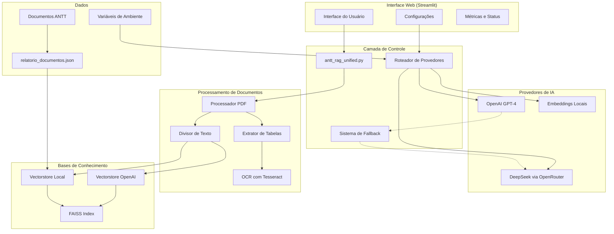
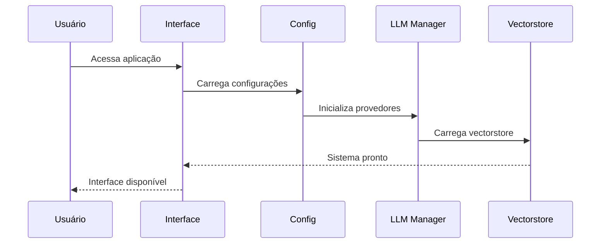
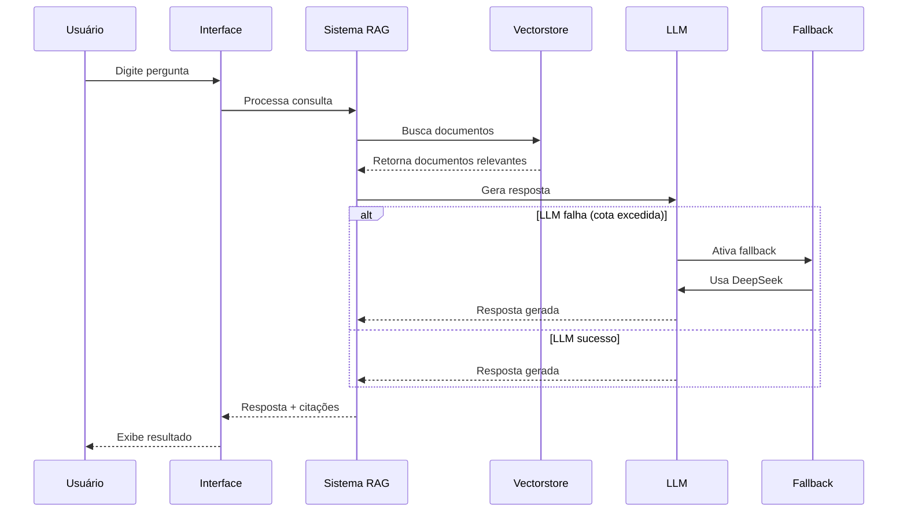
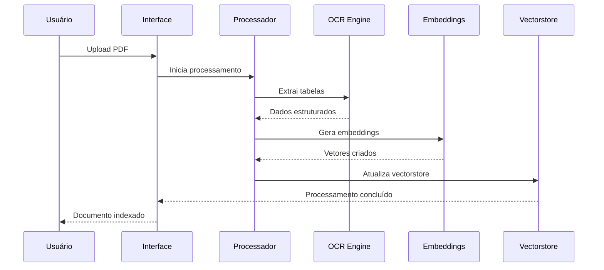
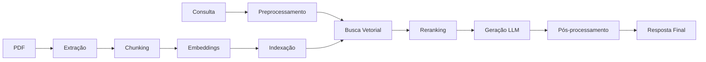

# 🚛 Sistema RAG Unificado - ANTT

## 📋 Índice

1. [Visão Geral](#-visão-geral)
2. [Arquitetura do Sistema](#-arquitetura-do-sistema)
3. [Funcionalidades](#-funcionalidades)
4. [Fluxo de Processamento](#-fluxo-de-processamento)
5. [Componentes Principais](#-componentes-principais)
6. [Configuração e Instalação](#-configuração-e-instalação)
7. [Uso do Sistema](#-uso-do-sistema)
8. [Templates Adaptativos](#-templates-adaptativos)
9. [Sistema de Fallback](#-sistema-de-fallback)
10. [Estrutura de Arquivos](#-estrutura-de-arquivos)
11. [API e Integrações](#-api-e-integrações)
12. [Troubleshooting](#-troubleshooting)
13. [Contribuição](#-contribuição)

---

## 🎯 Visão Geral

O **Sistema RAG Unificado - ANTT** é uma aplicação avançada de Retrieval-Augmented Generation (RAG) especializada em consultas a documentos regulatórios da Agência Nacional de Transportes Terrestres (ANTT). O sistema combina múltiplos provedores de IA, embeddings locais gratuitos e uma interface web intuitiva para fornecer respostas precisas e bem fundamentadas sobre regulamentações de transporte terrestre.

### 🌟 Características Principais

- **🤖 Múltiplos Provedores de IA**: Suporte a OpenAI (GPT-4) e DeepSeek
- **🆓 Embeddings Gratuitos**: Sistema de embeddings locais 100% gratuito usando sentence-transformers
- **🔄 Fallback Automático**: Sistema inteligente de fallback entre provedores
- **📚 Base de Conhecimento Dual**: Vectorstores OpenAI (pago) e local (gratuito)
- **🎨 Templates Adaptativos**: Templates otimizados para cada modelo de IA
- **🔍 Busca Híbrida**: Combinação de busca semântica e por palavras-chave
- **📊 Interface Moderna**: Interface web responsiva com Streamlit
- **⚡ Processamento Paralelo**: Extração e processamento otimizado de documentos

---

## 🏗️ Arquitetura do Sistema



### 🔧 Componentes da Arquitetura

#### 1. **Camada de Apresentação**
- **Streamlit**: Interface web moderna e responsiva
- **Componentes visuais**: Métricas, gráficos, status em tempo real
- **Configurações dinâmicas**: Seleção de provedores, modelos e parâmetros

#### 2. **Camada de Lógica de Negócio**
- **Roteador inteligente**: Seleção automática do melhor provedor
- **Sistema de fallback**: Recuperação automática em caso de falhas
- **Templates adaptativos**: Otimização de prompts por modelo

#### 3. **Camada de Dados**
- **Vectorstores duais**: OpenAI (pago) e local (gratuito)
- **Índices FAISS**: Busca vetorial eficiente
- **Cache inteligente**: Otimização de performance

#### 4. **Camada de Integração**
- **APIs externas**: OpenAI, OpenRouter (DeepSeek)
- **Processamento local**: sentence-transformers, Tesseract OCR
- **Gerenciamento de configurações**: Variáveis de ambiente seguras

---

## ⚡ Funcionalidades

### 🔍 **Consulta Inteligente**
- **Busca semântica avançada**: Compreensão do contexto e intenção
- **Busca híbrida**: Combinação de métodos semânticos e por palavras-chave
- **Reranking inteligente**: Ordenação por relevância contextual
- **Filtros avançados**: Por tipo de documento, ano, número

### 🤖 **IA Multimodal**
- **Múltiplos provedores**: OpenAI GPT-4, DeepSeek
- **Templates adaptativos**: Otimizados para cada modelo
- **Fallback automático**: Troca transparente entre provedores
- **Configuração dinâmica**: Temperatura, tokens, parâmetros

### 📚 **Gestão de Conhecimento**
- **Base dual**: Vectorstores OpenAI e local
- **Embeddings gratuitos**: sentence-transformers offline
- **Indexação automática**: Processamento de novos documentos
- **Metadados ricos**: Informações detalhadas dos documentos

### 📊 **Processamento de Documentos**
- **Extração de tabelas**: OCR avançado com img2table
- **Análise de parâmetros**: Identificação de descumprimentos
- **Processamento paralelo**: Otimização de performance
- **Múltiplos formatos**: PDF, texto, imagens

### 🎨 **Interface Avançada**
- **Design responsivo**: Adaptável a diferentes dispositivos
- **Métricas em tempo real**: Status, progresso, estatísticas
- **Exemplos interativos**: Consultas pré-definidas
- **Exportação de resultados**: Citações e fontes estruturadas

---

## 🔄 Fluxo de Processamento

### 1. **Inicialização do Sistema**



### 2. **Processamento de Consulta**



### 3. **Processamento de Documentos**



---

## 🧩 Componentes Principais

### 📁 **antt_rag_unified.py** (Sistema Principal)

**Responsabilidades:**
- Orquestração geral do sistema
- Interface web com Streamlit
- Processamento de consultas
- Gerenciamento de templates
- Sistema de fallback

**Funções Principais:**
```python
def interface_usuario_unificada()  # Interface principal
def gerar_resposta()              # Geração de respostas
def pesquisar_documentos()        # Busca híbrida
def carregar_vectorstore()        # Carregamento de dados
def process_pdf()                 # Processamento de PDFs
```

### ⚙️ **config.py** (Configurações)

**Responsabilidades:**
- Gerenciamento de variáveis de ambiente
- Configuração de provedores
- Constantes do sistema
- Logging centralizado

**Configurações Principais:**
```python
LLM_PROVIDERS = {
    "openai": {...},
    "deepseek": {...}
}

DB_FAISS_PATH = "vectorstore/db_faiss"
CHUNK_SIZE = 500
CHUNK_OVERLAP = 150
```

### 🤖 **llm_providers.py** (Gerenciamento de IA)

**Responsabilidades:**
- Abstração de provedores de IA
- Embeddings locais gratuitos
- Gerenciamento de APIs
- Sistema de fallback

**Classes Principais:**
```python
class LLMManager:           # Gerenciador unificado
class LocalEmbeddings:      # Embeddings gratuitos
```

### 📊 **Estrutura de Dados**

#### **Metadados de Documentos:**
```json
{
    "tipo_documento": "RES",
    "nome_tipo": "Resolução",
    "numero": "6057",
    "ano": "2024",
    "caminho": "dados_antt/RES/2024/RES-00006057-2024.md",
    "chunk": 1,
    "total_chunks": 487,
    "titulo": "Título do documento",
    "ementa": "Descrição do documento"
}
```

#### **Configuração de Provedores:**
```python
{
    "name": "DeepSeek (via OpenRouter)",
    "base_url": "https://openrouter.ai/api/v1",
    "models": {
        "deepseek-chat": "deepseek/deepseek-chat",
        "deepseek-r1": "deepseek/deepseek-r1:free"
    },
    "get_api_key": get_openrouter_api_key,
    "extra_headers": {
        "HTTP-Referer": "https://rag-antt.streamlit.app",
        "X-Title": "RAG-ANTT"
    }
}
```

---

## 🛠️ Configuração e Instalação

### 📋 **Pré-requisitos**

- Python 3.8+
- pip (gerenciador de pacotes)
- Git
- Tesseract OCR (para extração de tabelas)

### 🚀 **Instalação**

1. **Clone o repositório:**
```bash
git clone https://github.com/romulobrito/RAG-ANTT.git
cd RAG-ANTT
```

2. **Crie ambiente virtual:**
```bash
python -m venv venv
source venv/bin/activate  # Linux/Mac
# ou
venv\Scripts\activate     # Windows
```

3. **Instale dependências:**
```bash
pip install -r requirements.txt
```

4. **Configure variáveis de ambiente:**
```bash
# Crie arquivo .env
cp .env.example .env

# Edite com suas chaves de API
OPENAI_API_KEY=sua_chave_openai_aqui
OPENROUTER_API_KEY=sua_chave_openrouter_aqui
```

5. **Instale Tesseract OCR:**
```bash
# Ubuntu/Debian
sudo apt-get install tesseract-ocr tesseract-ocr-por

# macOS
brew install tesseract tesseract-lang

# Windows
# Baixe de: https://github.com/UB-Mannheim/tesseract/wiki
```

### ⚙️ **Configuração Avançada**

#### **Embeddings Locais (100% Gratuito):**
```bash
# Instalar sentence-transformers
pip install sentence-transformers torch

# O modelo será baixado automaticamente na primeira execução
```

#### **Configuração de Provedores:**
```python
# config.py
DEFAULT_LLM_PROVIDER = "deepseek"  # ou "openai"
DEFAULT_LLM_MODEL = "deepseek-chat"
DEFAULT_EMBEDDING_MODEL = "text-embedding-ada-002"
```

---

## 🎮 Uso do Sistema

### 🚀 **Inicialização**

```bash
# Ativar ambiente virtual
source venv/bin/activate

# Executar aplicação
streamlit run antt_rag_unified.py --server.port 8501
```

### 🖥️ **Interface Web**

#### **Painel Principal:**
- **Campo de consulta**: Digite sua pergunta sobre regulamentações ANTT
- **Botões de ação**: Consultar, Limpar, Exemplos
- **Status do sistema**: Indicadores de saúde dos componentes

#### **Configurações (Sidebar):**
- **Provedor de IA**: OpenAI ou DeepSeek
- **Modelo**: Seleção do modelo específico
- **Embeddings**: Local (gratuito) ou OpenAI (pago)
- **Parâmetros**: Temperatura, tokens, documentos para busca
- **Filtros**: Tipo de documento, ano, número

#### **Resultados:**
- **Resposta estruturada**: Com citações e fontes
- **Documentos citados**: Trechos relevantes dos documentos
- **Detalhes da busca**: Informações sobre o processamento
- **Todas as fontes**: Lista completa de documentos consultados

### 📝 **Exemplos de Consultas**

#### **Consultas Técnicas:**
```
"Quais são os parâmetros técnicos para pavimentos rodoviários?"
"Critérios de deflexão máxima permitida em rodovias"
"Índices de irregularidade longitudinal (IRI) para diferentes classes de rodovias"
```

#### **Consultas Normativas:**
```
"Resolução 6057 de 2024 - principais pontos"
"Procedimentos para licenciamento de transportadoras"
"Penalidades por descumprimento das normas de transporte"
```

#### **Consultas Procedimentais:**
```
"Como funciona o processo de fiscalização da ANTT?"
"Documentos necessários para registro de empresa de transporte"
"Prazos para renovação de licenças de operação"
```

### 🔧 **Configurações Avançadas**

#### **Modo Econômico (100% Gratuito):**
```python
# Configurar para usar apenas recursos gratuitos
embedding_provider = "local"
llm_provider = "deepseek"
```

#### **Modo Performance (Pago):**
```python
# Configurar para máxima qualidade
embedding_provider = "openai"
llm_provider = "openai"
model = "gpt-4"
```

#### **Modo Híbrido (Recomendado):**
```python
# Embeddings gratuitos + LLM pago quando necessário
embedding_provider = "free"  # Tenta local, fallback OpenAI
llm_provider = "deepseek"    # Gratuito como padrão
```

---

## 🎨 Templates Adaptativos

O sistema utiliza templates otimizados para cada modelo de IA, maximizando a qualidade das respostas.

### 📋 **Tipos de Templates**

#### **1. Templates de Resposta Padrão**
- **Base**: Template genérico balanceado
- **GPT-4**: Estruturado e detalhado
- **DeepSeek**: Direto e conciso

#### **2. Templates de Extração Agressiva**
- Usados quando a resposta inicial é insatisfatória
- Focam em extrair TODAS as informações relevantes
- Conectam informações fragmentadas

#### **3. Templates Especializados**
- **Parâmetros Técnicos**: Para consultas sobre especificações
- **Análise Normativa**: Para aspectos jurídicos e regulatórios

### 🔄 **Seleção Automática**

```python
def selecionar_template_adaptativo(template_base, modelo_usado):
    """
    Seleciona o template mais adequado baseado no modelo de LLM usado.
    """
    is_gpt4 = any(gpt in modelo_usado.lower() for gpt in ['gpt-4', 'gpt4', 'openai'])
    is_deepseek = any(ds in modelo_usado.lower() for ds in ['deepseek', 'deep-seek'])
    
    if is_gpt4:
        return template_map[template_base]['gpt4']
    elif is_deepseek:
        return template_map[template_base]['deepseek']
    else:
        return template_map[template_base]['base']
```

### 📊 **Exemplos de Templates**

#### **Template GPT-4 (Estruturado):**
```
## CONTEXTO DA CONSULTA
Pergunta: "{question}"

## INSTRUÇÕES DETALHADAS DE ANÁLISE
### 1. ANÁLISE DOCUMENTAL
- Examine minuciosamente cada documento fornecido
- Identifique conexões entre diferentes fontes
- Priorize informações mais recentes e específicas

### 2. ESTRUTURAÇÃO DA RESPOSTA
- Use hierarquia clara: títulos, subtítulos, listas
- Organize cronologicamente quando relevante
- Separe aspectos técnicos, jurídicos e práticos
```

#### **Template DeepSeek (Direto):**
```
PERGUNTA: "{question}"

INSTRUÇÕES:
• Analise os documentos e extraia informações relevantes
• Seja objetivo e direto na resposta
• Use listas e marcadores para organizar informações
• Cite sempre: [TIPO DOCUMENTO] [NÚMERO]/[ANO]
• Se não encontrar informação, diga claramente

FORMATO DA RESPOSTA:
1. Resposta direta à pergunta
2. Detalhes técnicos/normativos (se aplicável)
3. Fontes citadas
```

---

## 🔄 Sistema de Fallback

### 🎯 **Objetivo**
Garantir disponibilidade contínua do sistema mesmo quando um provedor falha ou atinge limites de cota.

### 🔧 **Funcionamento**

#### **1. Detecção de Falhas**
```python
# Detecta erros específicos de cota excedida
error_keywords = ["insufficient_quota", "429", "quota", "exceeded"]
if any(keyword in error_msg.lower() for keyword in error_keywords):
    # Ativa fallback
```

#### **2. Hierarquia de Fallback**
1. **Provedor Primário**: Selecionado pelo usuário
2. **Provedor Secundário**: DeepSeek (sempre disponível)
3. **Modo Emergência**: Busca sem embeddings

#### **3. Transparência para o Usuário**
```python
if modelo_usado_final != provider_usado:
    st.info("🔄 Fallback Automático Ativado: OpenAI indisponível, DeepSeek usado")
```

### 📊 **Estratégias de Fallback**

#### **Para LLMs:**
```
OpenAI GPT-4 → DeepSeek → Modo Emergência
```

#### **Para Embeddings:**
```
OpenAI Embeddings → Local Embeddings → Busca por Texto
```

#### **Para Vectorstores:**
```
Vectorstore OpenAI → Vectorstore Local → Busca em JSON
```

### 🛡️ **Recuperação Automática**
- **Retry com backoff exponencial**: Para falhas temporárias
- **Circuit breaker**: Evita sobrecarga de APIs
- **Health checks**: Monitoramento contínuo dos provedores

---

## 📁 Estrutura de Arquivos

```
RAG-ANTT/
├── 📄 antt_rag_unified.py          # Sistema principal
├── ⚙️ config.py                    # Configurações
├── 🤖 llm_providers.py             # Gerenciamento de IA
├── 📋 requirements.txt             # Dependências
├── 🔐 .env                         # Variáveis de ambiente
├── 📊 relatorio_documentos.json    # Dados dos documentos
├── 🛠️ gerar_relatorio.py           # Gerador de relatório
├── 🏗️ criar_vectorstore_deepseek.py # Criador de vectorstore
├── 🚫 .gitignore                   # Arquivos ignorados pelo Git
├── 📖 README.md                    # Esta documentação
│
├── 📁 dados_antt/                  # Documentos da ANTT
│   ├── 📁 RES/                     # Resoluções
│   ├── 📁 INM/                     # Instruções Normativas
│   ├── 📁 DLB/                     # Deliberações
│   └── 📁 POR/                     # Portarias
│
├── 📁 vectorstore/                 # Base OpenAI (paga)
│   └── 📄 db_faiss/
│
├── 📁 vectorstore_local/           # Base local (gratuita)
│   └── 📄 index.faiss
│
├── 📁 venv/                        # Ambiente virtual
│
└── 📁 .git/                        # Controle de versão
```

### 📋 **Descrição dos Arquivos**

#### **Arquivos Principais:**
- **`antt_rag_unified.py`**: Sistema principal com interface Streamlit
- **`config.py`**: Configurações centralizadas e constantes
- **`llm_providers.py`**: Abstração para múltiplos provedores de IA
- **`requirements.txt`**: Lista de dependências Python

#### **Dados e Configuração:**
- **`.env`**: Chaves de API e configurações sensíveis
- **`relatorio_documentos.json`**: Metadados dos documentos ANTT
- **`dados_antt/`**: Documentos originais em formato Markdown

#### **Bases de Conhecimento:**
- **`vectorstore/`**: Vectorstore OpenAI (embeddings pagos)
- **`vectorstore_local/`**: Vectorstore local (embeddings gratuitos)

#### **Utilitários:**
- **`gerar_relatorio.py`**: Gera relatório dos documentos
- **`criar_vectorstore_deepseek.py`**: Cria vectorstore local

---

## 🔌 API e Integrações

### 🌐 **APIs Externas**

#### **OpenAI API**
```python
# Configuração
{
    "base_url": "https://api.openai.com/v1",
    "models": ["gpt-4", "gpt-4o", "gpt-3.5-turbo"],
    "embeddings": "text-embedding-ada-002"
}
```

#### **OpenRouter API (DeepSeek)**
```python
# Configuração
{
    "base_url": "https://openrouter.ai/api/v1",
    "models": ["deepseek/deepseek-chat", "deepseek/deepseek-r1:free"],
    "headers": {
        "HTTP-Referer": "https://rag-antt.streamlit.app",
        "X-Title": "RAG-ANTT"
    }
}
```

### 🔧 **Integrações Locais**

#### **Sentence Transformers**
```python
# Modelo local para embeddings
model = SentenceTransformer("all-MiniLM-L6-v2")
embeddings = model.encode(texts, batch_size=32)
```

#### **FAISS (Facebook AI Similarity Search)**
```python
# Índice vetorial para busca eficiente
vectorstore = FAISS.from_documents(documents, embeddings)
results = vectorstore.similarity_search(query, k=10)
```

#### **Tesseract OCR**
```python
# OCR para extração de tabelas
ocr = TesseractOCR(n_threads=4, lang="por")
tables = pdf.extract_tables(ocr=ocr)
```

### 📊 **Formatos de Dados**

#### **Entrada:**
- **PDF**: Documentos para processamento
- **Texto**: Consultas do usuário
- **JSON**: Configurações e metadados

#### **Saída:**
- **Markdown**: Respostas formatadas
- **JSON**: Metadados e estruturas
- **HTML**: Interface web

### 🔄 **Fluxo de Dados**



---

## 🔧 Troubleshooting

### ❌ **Problemas Comuns**

#### **1. Erro de Chave de API**
```
Erro: Chave da API OpenAI não encontrada
```
**Solução:**
```bash
# Verificar arquivo .env
cat .env

# Configurar variável
export OPENAI_API_KEY="sua_chave_aqui"
```

#### **2. Cota Excedida OpenAI**
```
Error: You exceeded your current quota
```
**Solução:**
- Sistema ativa fallback automático para DeepSeek
- Verificar créditos na conta OpenAI
- Usar modo gratuito (embeddings locais + DeepSeek)

#### **3. Erro de Dependências**
```
ModuleNotFoundError: No module named 'sentence_transformers'
```
**Solução:**
```bash
pip install sentence-transformers torch
```

#### **4. Tesseract não encontrado**
```
TesseractNotFoundError
```
**Solução:**
```bash
# Ubuntu/Debian
sudo apt-get install tesseract-ocr

# Configurar PATH se necessário
export PATH="/usr/bin/tesseract:$PATH"
```

#### **5. Vectorstore não encontrado**
```
Erro: Vectorstore não encontrado
```
**Solução:**
- Sistema cria automaticamente vectorstore local
- Verificar permissões de escrita
- Executar `python criar_vectorstore_deepseek.py`

### 🔍 **Diagnóstico**

#### **Verificar Status do Sistema:**
```python
# Testar importações
python -c "import antt_rag_unified; print('✅ Sistema OK')"
python -c "import llm_providers; print('✅ LLM Providers OK')"
python -c "import config; print('✅ Config OK')"
```

#### **Verificar APIs:**
```python
# Testar OpenAI
from config import get_openai_api_key
print(f"OpenAI Key: {'✅' if get_openai_api_key() else '❌'}")

# Testar OpenRouter
from config import get_openrouter_api_key
print(f"OpenRouter Key: {'✅' if get_openrouter_api_key() else '❌'}")
```

#### **Verificar Embeddings Locais:**
```python
# Testar sentence-transformers
try:
    from sentence_transformers import SentenceTransformer
    model = SentenceTransformer("all-MiniLM-L6-v2")
    print("✅ Embeddings locais funcionando")
except Exception as e:
    print(f"❌ Erro: {e}")
```

### 📊 **Logs e Monitoramento**

#### **Ativar Logs Detalhados:**
```python
import logging
logging.basicConfig(level=logging.DEBUG)
```

#### **Verificar Métricas:**
- Interface mostra status em tempo real
- Logs no terminal durante execução
- Métricas de performance na sidebar

### 🛠️ **Soluções Avançadas**

#### **Limpeza de Cache:**
```bash
# Remover cache Python
rm -rf __pycache__/

# Limpar cache do modelo
rm -rf ~/.cache/huggingface/
```

#### **Reinstalação Completa:**
```bash
# Remover ambiente virtual
rm -rf venv/

# Recriar ambiente
python -m venv venv
source venv/bin/activate
pip install -r requirements.txt
```

#### **Modo de Recuperação:**
```python
# Usar apenas recursos locais
embedding_provider = "local"
llm_provider = "deepseek"
# Sistema funcionará mesmo sem OpenAI
```

---

## 🤝 Contribuição

### 🎯 **Como Contribuir**

1. **Fork do repositório**
2. **Crie uma branch para sua feature**
3. **Implemente as mudanças**
4. **Adicione testes se necessário**
5. **Submeta um Pull Request**

### 📋 **Diretrizes**

#### **Código:**
- Siga PEP 8 para Python
- Adicione docstrings para funções
- Use type hints quando possível
- Mantenha compatibilidade com Python 3.8+

#### **Documentação:**
- Atualize README.md se necessário
- Adicione comentários explicativos
- Documente novas funcionalidades

#### **Testes:**
- Teste com múltiplos provedores
- Verifique fallbacks
- Teste com dados reais

### 🐛 **Reportar Bugs**

Use o template:
```markdown
**Descrição do Bug:**
Descrição clara do problema

**Passos para Reproduzir:**
1. Vá para '...'
2. Clique em '...'
3. Veja o erro

**Comportamento Esperado:**
O que deveria acontecer

**Screenshots:**
Se aplicável

**Ambiente:**
- OS: [e.g. Ubuntu 20.04]
- Python: [e.g. 3.9]
- Versão: [e.g. 1.0.0]
```

### 💡 **Sugerir Melhorias**

- **Novas funcionalidades**
- **Otimizações de performance**
- **Melhorias na interface**
- **Novos provedores de IA**

---

## 📄 Licença

Este projeto está licenciado sob a [MIT License](LICENSE).

---

## 👥 Autores

- **Romulo Brito** - *Desenvolvimento inicial* - [@romulobrito](https://github.com/romulobrito)

---

## 🙏 Agradecimentos

- **ANTT** - Pela disponibilização dos documentos regulatórios
- **OpenAI** - Pela API GPT-4 e embeddings
- **DeepSeek** - Pelo modelo gratuito via OpenRouter
- **Hugging Face** - Pelos modelos sentence-transformers
- **Streamlit** - Pela framework de interface web
- **LangChain** - Pela abstração de LLMs

---

## 📞 Suporte

Para suporte técnico:
- **Issues**: [GitHub Issues](https://github.com/romulobrito/RAG-ANTT/issues)
- **Discussões**: [GitHub Discussions](https://github.com/romulobrito/RAG-ANTT/discussions)
- **Email**: [contato](mailto:seu-email@exemplo.com)

---

**🚛 Sistema RAG Unificado - ANTT** | Versão 2.0 | 2025 