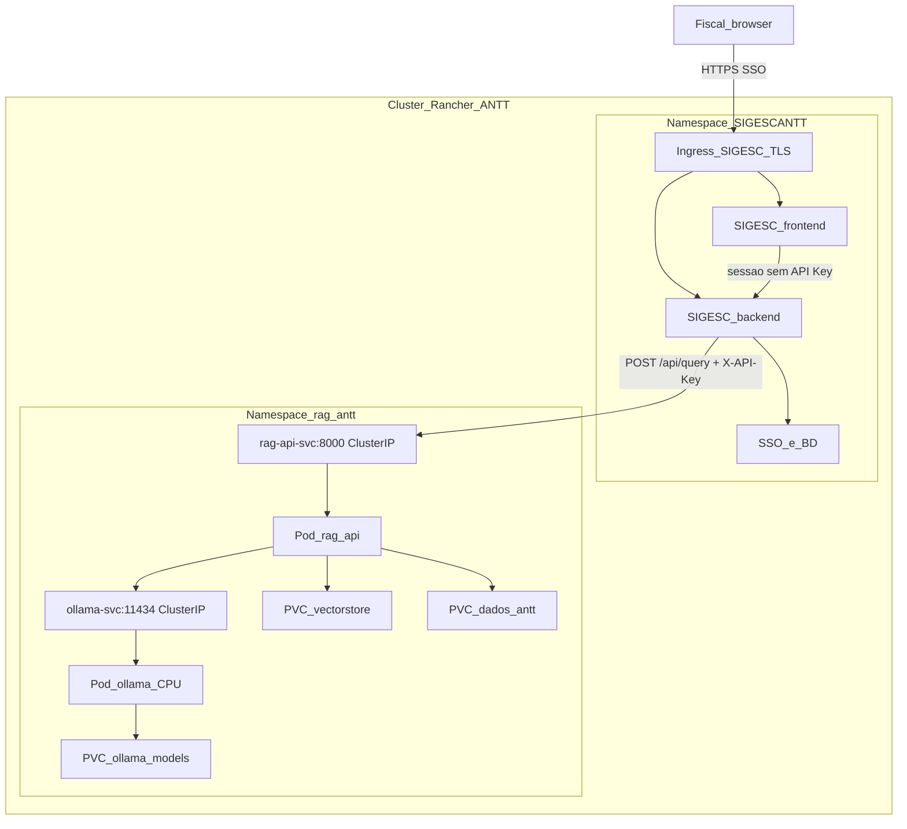

# Especificacoes de arquitetura norteadas pelo Oficio SEI 41978334

**Destino:** secao a incorporar em `piloto_llm_local_avaliacao.tex` (e no PDF).

**O que este texto e:** especificacoes de arquitetura e questoes do ofício GESIN/SUTEC que nortearam o desenvolvimento do nucleo de IA.

**O que este texto nao e:** o plano de implementacao (SP-0 a SP-6, FastAPI, Dockerfiles, manifests). Esse plano vive em `plano_api_rag_sigescantt.md`.

**Status:** rascunho em Markdown. A gravacao no `.tex` ficou bloqueada no Plan mode; aplicar no LaTeX na proxima sessao em Agent e recompilar o PDF.

---

## Identificacao do expediente

- **Oficio:** SEI n. 15856/2026/GEFOP/SUROD/DIR-ANTT
- **Documento verificador:** 41978334 (CRC 26504967)
- **Processo:** 50505.018043/2024-14 (classificado como publico no SEI)
- **Conteudo encaminhado:** manifestacao da GESIN/SUTEC (Despacho SEI n. 41864178) sobre requisitos minimos de aceite tecnico das entregas de Inteligencia Artificial do SIGESCANTT
- **Antecedentes citados no oficio:** Despacho GESIN SEI n. 32906979 (ambiente GETIC, pedido de containerizacao, segregacao frontend/backend, GitLab ANTT, implantacao em Rancher); ticket Citsmart 220734 (nao esgota o aceite de IA)

A GESIN (itens 9 e 10) limita-se a arquitetura, integracao, implantacao, seguranca, governanca tecnica e sustentacao. Escopo negocial, pertinencia funcional e suficiencia para objetivos regulatorio/fiscalizatorio competem as areas finalisticas. A homologacao de merito das saidas da IA nao e exclusiva da GESIN (item 7).

## Item 1 --- Arquitetura da solucao

O oficio exige componentes desacoplados e containerizados, implantaveis no padrao ANTT, com delimitacao clara entre:

1. **Camada de apresentacao** --- SIGESCANTT (UI, SSO, perfis, BD). Fora do nucleo RAG.
2. **Servicos de negocio / IA** --- API HTTP do RAG (caixa-preta: pergunta + filtros in; resposta + fontes out). Nao escreve no BD do SIGESC e nao executa regra operacional.
3. **Servicos de inferencia** --- Ollama local (CPU-only neste ciclo), ClusterIP `ollama-svc:11434`. Nunca internet. Embeddings locais (sentence-transformers).
4. **Armazenamento** --- PVCs `vectorstore-data`, `ollama-models`, `dados-antt`. Sem acesso direto a banco corporativo.

Substitutibilidade: o nucleo transacional do SIGESC nao deve depender do RAG estar no ar para o restante do sistema; consulta normativa e modulo. Inferencia trocavel por outro runtime OpenAI-compativel sem reescrever o SIGESC.

Piso tecnico deste perfil (arquitetura de referencia, piloto sem GPU): rag-api 2 CPU / 4 GB, ollama 4 CPU / 16 GB, Streamlit QA 1 CPU / 2 GB se ligado; total da ordem de **7 cores / 22 GB RAM**, sem GPU. Este piloto validou o teto pratico 3B--7B nesse perfil (gargalos I1--I4).

## Item 2 --- Integracao sistemica

Vedado acesso direto a banco. Integracao por servico/API.

Consulta normativa (unica linha operacional do RAG neste ciclo):

- **Origem:** backend SIGESCANTT
- **Destino:** `POST http://rag-api-svc:8000/api/query` (ClusterIP no Rancher)
- **Finalidade:** consulta a base documental da ANTT
- **Dados ida:** `pergunta`, `filtros`, `max_documentos`, `temperatura`, `correlation_id` opaco
- **Dados volta:** `resposta`, `documentos_consultados`, `modelo_usado`, `provider`, `request_id`, `tempo_processamento_ms`
- **Frequencia:** sob demanda (nao ha sincronizacao periodica; crawler fora deste ciclo)
- **Auth:** API Key de **servico** (header `X-API-Key`), nao SSO e nao chave do fiscal
- **PII:** o RAG nao recebe identificador de fiscal
- **Responsavel origem:** OTI/SIGESC
- **Responsavel destino:** DeepFeed (nucleo RAG)

O browser do fiscal **nao** chama o RAG. Fluxo: HTTPS no Ingress **do SIGESC** -> backend SIGESC -> ClusterIP do RAG. Ingress `/api/rag/*` e opcional so para consumidor **fora** do cluster (ANTT decide). CORS no RAG desligado: a chamada e server-to-server.

Probes Kubernetes (`/api/health`, `/api/ready`) nao levam API Key (kubelet). Consulta exige a key.

## Item 3 --- Ambientes tecnologicos

Entregas passaveis de implantacao em desenvolvimento, homologacao/testes e producao, controlados pela ANTT (Rancher). Promocao com rastreio de versao (tag git = digest da imagem). Entrada em producao so apos validacao tecnica SUTEC/GESIN **e** validacao funcional da area demandante.

Este piloto **nao** e o deploy Rancher; simula o **perfil** CPU-only / Ollama local esperado ate provisionar GPU.

## Item 4 --- Artefatos para aceite tecnico

O oficio pede codigo, scripts de implantacao, configuracao, documentacao de arquitetura e de APIs, modelos treinados **quando aplicavel**, scripts de treino **quando aplicavel**, dependencias, reinstalacao/rollback.

Para o RAG documental: **nao ha modelo treinado pela DeepFeed nem scripts de treino** (ver item 6). Artefatos pertinentes: codigo do nucleo, contrato HTTP, documentacao de arquitetura, imagens containerizadas, YAML ClusterIP, scripts install/rollback, relacao de dependencias e licencas de terceiros (Ollama, pesos Qwen, FAISS, etc.). A solucao nao deve depender de API de nuvem no perfil de producao (`RAG_LLM_CLOUD_FALLBACK=false`).

## Item 5 --- Seguranca, governanca e riscos de IA

O oficio pede autenticacao institucional, perfis, logs, gestao de segredos, criptografia, LGPD, **e** avaliacao de riscos da funcionalidade de IA (limitacoes, erro, falso positivo/negativo, mitigacao).

Recorte de arquitetura:

- Autenticacao de **pessoas** e perfis: SIGESCANTT (SSO). O RAG nao gerencia usuario.
- Credencial na ponta da integracao: API Key de servico no Secret Kubernetes (GETIC) e no backend SIGESC (OTI). Sem a key: 401. Pod sem Secret: 503 de misconfiguracao.
- Logs tecnicos: `request_id` (RAG) correlacionavel a `correlation_id` opaco do SIGESC. Por default **nao** gravar pergunta nem resposta.
- Segredos: fora do git; rotacao = Secret + rollout.
- TLS em transito: Ingress do SIGESC (ANTT). ClusterIP interno no trecho SIGESC-RAG.
- Dados pessoais: o nucleo RAG nao deve receber `user_id` nem nome do fiscal.

Riscos de IA **ja evidenciados neste piloto** (alimentam o item 5, sem homologacao de merito):

- **I1** --- latencia CPU-only (dezenas de segundos a minutos; primeira carga 7B ~1 min). Mitigacao: timeout do cliente SIGESC >= 120 s; replica 1; expectativa calibrada.
- **I2** --- teto ~7B quantizado no piso 22 GB sem GPU. Mitigacao: pin 7B (ou 3B se a VM nao aguentar); nao comprometer 13B+ neste perfil.
- **I3** --- contencao de memoria (app + embeddings + Ollama).
- **I4** --- ausencia de GPU no provisionamento atual.
- **Extracao de tabela / alucinacao:** modelo 7B pode errar rotulo ou valor mesmo com trecho correto. Mitigacao: fontes obrigatorias no JSON; humano no SIGESC confirma antes de ato administrativo; RAG nao e parecer juridico automatico.

## Item 6 --- Dados, treinamento e rastreabilidade

"Caso existam modelos treinaveis..." --- **nao se aplica** a este nucleo: nao ha fine-tune, dataset de instrucao nem pesos treinados pela DeepFeed.

Rastreabilidade pertinente:

- Origem documental: `dados_antt/` (PVC `dados-antt`)
- Indice FAISS/BM25: `vectorstore_local` (PVC `vectorstore-data`); versao = data/job de reindex
- Tag do modelo Ollama (ex. `qwen2.5:7b`) e digest da imagem
- Embeddings locais
- Trilha da consulta: `request_id` + `correlation_id`

## Item 7 --- Homologacao

Aceite tecnico GESIN: instalacao, integracao HTTP, auth de servico, desempenho no uso esperado, observabilidade, comportamento funcional **tecnico** (JSON com fontes).

Aceite de **merito** da resposta (se o IRI esta certo, utilidade para o fiscal): area demandante, nao exclusivo da GESIN.

Este piloto e evidencia do **envelope de desempenho** CPU-only e do teto de modelo. Nao substitui teste de instalacao no Rancher da ANTT nem a homologacao funcional da SUROD/GEGIR. Carga esperada no piloto: baixa (ordem de <20 req/dia), uma consulta por vez --- nao ha pretensao de 100 RPS neste perfil.

## Item 8 --- Sustentacao

Documentacao operacional, backup/restore dos PVCs, atualizacao de imagem, rollback, requisitos minimos de infraestrutura (piso 7c/22GB CPU-only), licencas de terceiros. Transferencia de conhecimento a equipe ANTT. Fora: sustentacao da UI/SSO do SIGESC.

## Itens 9 e 10 --- Delimitacao e conclusao da GESIN

O ambiente GETIC/Citsmart ja informado **nao substitui** o aceite das entregas de IA. Ha viabilidade tecnica se as diretrizes acima forem observadas. Homologacao e producao condicionadas a documentacao e evidencias. Merito das saidas: area de negocio, com apoio SUTEC no que couber.

## Topologia de integracao no Rancher (especificacao)

URL se namespaces distintos: `http://rag-api-svc.rag-antt.svc.cluster.local:8000`.

## O que o oficio pede e nao e especificacao do RAG

- Tela do fiscal, SSO, RBAC de usuario, criptografia do BD SIGESC
- Ingress/TLS do SIGESCANTT (ANTT/OTI)
- Apply no cluster (GETIC)
- Homologacao juridica automatica da `resposta`
- Crawler de atualizacao da base
- GPU / modelos 13B+ neste ciclo
- Dataset de treino e fine-tune
