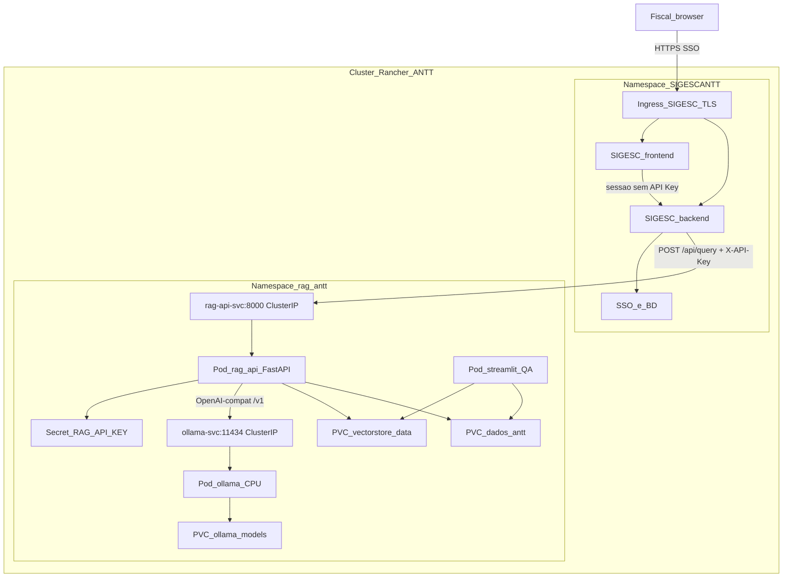
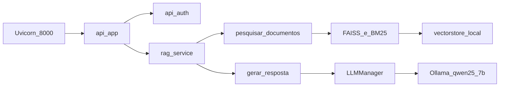
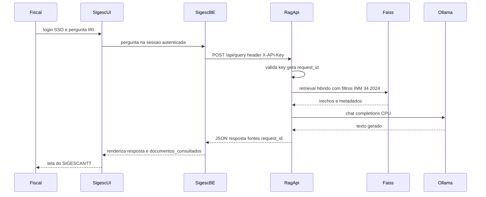
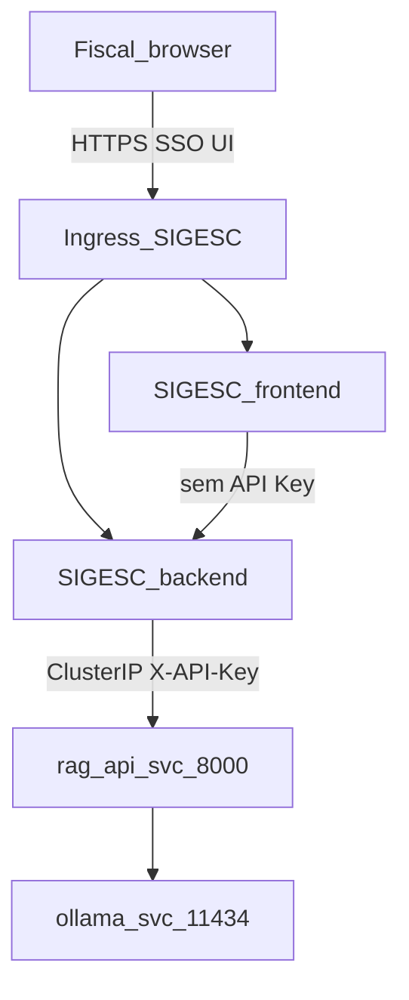
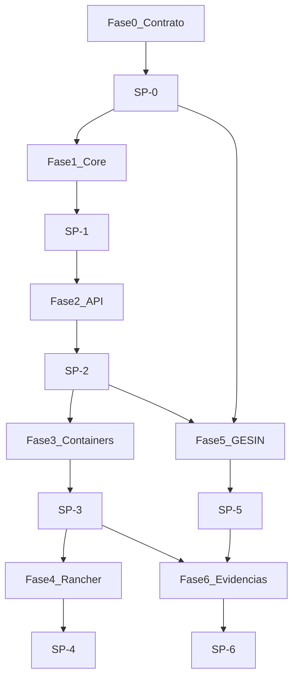

# Plano: RAG-ANTT como API para o SIGESCANTT

**Classificacao:** plano de desenvolvimento (DeepFeed) --- snapshot para o repositorio.

**Data do snapshot:** 2026-09-11. Revisao do recorte de tela e dos padroes de ambiente: 2026-09-22.

**Escopo:** 7 fases (SP-0 a SP-6). Frontend, login e BD ficam no SIGESCANTT. Este arquivo e copia do plano mestre usado no Cursor; a execucao do codigo ainda nao comecou.

**Relacionados:** [arquitetura_rag_api.tex](arquitetura_rag_api.tex), [piloto_llm_local_avaliacao.tex](piloto_llm_local_avaliacao.tex).

## O que sera implementado, e por que

Cada peca existe para um requisito concreto (oficio SEI 41978334 aplicavel ao IA **ou** para o SIGESCANTT conseguir consultar o RAG sem conhecer FAISS/Ollama). Nada de login, tela de usuario ou BD de negocio entra neste ciclo.

- **Contrato HTTP/JSON (`/api/query` e demais)** — **Por que:** o oficio exige integracao por API, vedado acesso direto a banco; o SIGESCANTT so sabe enviar pergunta e renderizar resposta. Sem contrato fechado o front nao integra em paralelo.
- **Facade `rag_service.py` (core sem Streamlit)** — **Por que:** hoje busca e geracao vivem no monolito da UI. A API nao pode importar Streamlit; QA interno e producao precisam do **mesmo** pipeline para a resposta nao divergir.
- **FastAPI + Pydantic + erros HTTP estaveis** — **Por que:** e a camada de negocio/IA desacoplada da apresentacao (oficio §1). Validacao e codigos 400/401/503/504 permitem ao SIGESC tratar falha sem parsear stacktrace.
- **API Key de servico (SIGESC -> RAG)** — **Por que:** usuarios autenticam no SIGESCANTT; o RAG ainda precisa recusar chamada anonima na rede interna (oficio §2 mecanismo de auth na ponta da integracao). Nao e SSO.
- **Health / ready / status** — **Por que:** Rancher so promove pod saudavel (oficio §3 implantabilidade; §7 observabilidade minima). `health` = processo vivo; `ready` = indice + Ollama aptos a responder.
- **Logs com `request_id` (sem gestao de usuario)** — **Por que:** trilha tecnica de auditoria da consulta de IA (oficio §5 logs), correlacionavel pelo SIGESC via `correlation_id` opaco. O RAG nao guarda login.
- **Docker + manifests ClusterIP + scripts install/rollback** — **Por que:** containerizacao, segregacao frontend/backend, artefactos de implantacao e rollback (oficio §1, §4, §8). Ollama nunca vai para a internet.
- **Streamlit como pod QA** — **Por que:** DeepFeed precisa testar o mesmo core sem esperar a tela do SIGESC; nao e produto.
- **Pacote GESIN (matriz, riscos de IA, manual ops, guia de consumo)** — **Por que:** aceite tecnico do oficio nao e so codigo; e evidencia de integracao, limitacoes do modelo 7B CPU, backup do indice e como o SIGESC deve chamar a API.

## Exemplo ilustrativo (ponta a ponta)

Cenario: um fiscal da SUROD, ja logado no SIGESCANTT, precisa do limite de IRI da pista principal na fase de manutencao (INM 34/2024). Ele **nao** abre o Streamlit nem o Ollama.

1. No SIGESCANTT o usuario autentica (SSO/perfil/BD — responsabilidade deles). Digita: *"Qual o IRI maximo da pista principal na manutencao segundo a INM 34/2024?"*
2. O backend do SIGESCANTT monta o POST abaixo para o servico interno (ClusterIP). A API Key e de **aplicacao**, nao do fiscal.

```http
POST /api/query HTTP/1.1
Host: rag-api-svc:8000
X-API-Key: <segredo-do-servico>
Content-Type: application/json

{
  "pergunta": "Qual o IRI maximo da pista principal na manutencao segundo a INM 34/2024?",
  "filtros": { "tipo_documento": "INM", "ano": 2024, "numero": "34" },
  "correlation_id": "sigesc-ticket-8891"
}
```

3. O RAG valida a key, gera `request_id`, aplica os padroes de ambiente (temperatura 0.1, 30 trechos, teto de resposta 4096, provedor `ollama`) porque o SIGESC nao enviou esses campos, busca no FAISS/BM25 e chama Ollama (`qwen2.5:7b` em CPU). Devolve JSON, por exemplo:

```json
{
  "request_id": "a3f2c1e0-9b44-4c21-8d10-11aa22bb33cc",
  "correlation_id": "sigesc-ticket-8891",
  "resposta": "Segundo a INM 34/2024, o IRI maximo na pista principal na fase de manutencao e 2,7 m/km (...citacao...)",
  "modelo_usado": "qwen2.5:7b",
  "provider": "ollama",
  "documentos_consultados": [
    {
      "tipo": "INM",
      "numero": "34",
      "ano": "2024",
      "trecho": "Irregularidade Longitudinal Maxima - IRI | Principal | ... | 2,7 m/km",
      "caminho": "dados_antt/INM/2024/INM-00000034-2024.md",
      "relevancia": 0.91
    }
  ],
  "tempo_processamento_ms": 28000,
  "total_documentos_encontrados": 30,
  "embedding_provider": "local",
  "vectorstore_utilizado": "vectorstore_local"
}
```

4. O SIGESCANTT **mostra** a `resposta` e as fontes na propria tela, grava o `request_id` no historico deles se quiser, e trata timeout/503 com mensagem de negocio. O RAG nao sabe quem e o fiscal e nao grava isso no BD do SIGESC.

Se a key faltar: `401`. Se o Ollama estiver fora: `503` e o SIGESC avisa "consulta indisponivel". Se a pergunta vier vazia: `400`. Isso e o que a API implementa; a redacao amigavel na tela e do SIGESC.

## Premissas (nao negociar neste ciclo)

- **Produto de UI:** SIGESCANTT. O usuario nunca fala com o RAG direto.
- **Auth de pessoas, perfis, BD de negocio:** SIGESCANTT. Fora do codigo DeepFeed.
- **RAG:** caixa-preta HTTP/JSON. Consulta documental; nao escreve no BD do SIGESC nem executa regra operacional.
- **Streamlit:** ferramenta interna de QA/demonstracao (pod isolado), nao entrega de produto.
- **Auth SIGESC -> RAG:** credencial de servico (header `X-API-Key` / `Authorization: Bearer`), nao SSO. Rede alvo: ClusterIP no Rancher.
- **LLM:** Ollama local (CPU-only), alinhado ao perfil GETIC/arquitetura. Fallback cloud desligado em perfil de producao (`RAG_LLM_CLOUD_FALLBACK=false`).
- **Oficio SEI 41978334:** cumprir so o que cabe ao componente de IA (arquitetura desacoplada, API, artefatos, logs tecnicos, riscos de IA, implantabilidade, sustentacao do servico). Itens de SSO/perfis/UI/aceitacao de merito = SIGESC + area de negocio + ANTT.

## Tela do SIGESC e variaveis de ambiente

A barra lateral do Streamlit e bancada de QA. No SIGESC ela se reparte: o que o usuario ve na tela, e o que o Rancher fixa no pod. A tela nao traz botao de OpenAI ou DeepSeek gravado. Ela le `GET /api/status` e so desenha o que o ConfigMap liberou.

### O que a tela mostra

- **Servicos de IA.** No inicio so Ollama, sem lista. DeepSeek ou OpenAI aparecem quando `RAG_LLM_ALLOWED_PROVIDERS` os incluir. A chave nunca vai para o browser.
- **Atualizar base.** Um botao. A base e a mesma para todos. O backend chama `POST /api/reindex`. Segundo clique com job em andamento recebe 409.
- **Situacao dos servicos.** O que `GET /api/status` devolver, so dos provedores liberados.
- **Filtros de busca.** Tipo, ano e numero, no `POST /api/query`.
- **Ajuda.** Texto do SIGESC. Sem endpoint no RAG.
- **Processar documento.** Ao lado de Atualizar base, nao da caixa da pergunta. `POST /api/documents` grava o PDF na base comum. A consulta so passa a ve-lo depois de Atualizar base.
- **Nova conversa e o campo da pergunta.** Sessao do SIGESC. O RAG nao guarda historico.

### O que nao aparece na pergunta

**Como localizar os trechos** (embedding) nao e controle da consulta. O indice FAISS usa um tipo so. Trocar de `local` para OpenAI obriga reindexar a base inteira. Fica em `RAG_EMBEDDING_ALLOWED=local`. So entra na tela de Atualizar base se o ConfigMap listar um segundo valor.

Liberdade de redacao, tamanho da resposta e quantidade de trechos tambem nao sao controle do usuario. O SIGESC omite esses campos. A API preenche pelo ambiente.

### Padroes de ambiente (ConfigMap e Secret)

| Variavel | Onde | Valor inicial |
| --- | --- | --- |
| `RAG_LLM_ALLOWED_PROVIDERS` | ConfigMap | `ollama` |
| `RAG_LLM_MODEL` | ConfigMap | `qwen2.5:7b` |
| `RAG_LLM_TEMPERATURE` | ConfigMap | `0.1` (nao vai ao teto 1.0) |
| `RAG_LLM_MAX_TOKENS` | ConfigMap | `4096` (teto) |
| `RAG_MAX_DOCUMENTOS` | ConfigMap | `30` (teto do contrato: 40) |
| `RAG_EMBEDDING_ALLOWED` | ConfigMap | `local` |
| `RAG_VAGAS_GERACAO_LOCAL` | ConfigMap | `1` |
| `RAG_LLM_CLOUD_FALLBACK` | ConfigMap | `false` |
| `OLLAMA_BASE_URL` | ConfigMap | `http://ollama-svc:11434/v1` |
| `RAG_API_KEY` | Secret | gerada pela GETIC/GESIN |
| `OPENAI_API_KEY` / `OPENROUTER_API_KEY` | Secret | ausentes ate a Agencia liberar |

`RAG_VAGAS_GERACAO_LOCAL` limita geracoes Ollama neste processo. Provedor externo nao entra nessa fila: o paralelismo e do servico. Subir a vaga ou ligar nuvem continua decisao de cota e de assinatura, nao da tela.

Quando a Agencia comprar DeepSeek ou OpenAI: a chave entra no Secret, o ConfigMap passa a listar o provedor, o pod reinicia. A mesma tela mostra a opcao. Provedor fora da lista no `POST /api/query` responde 400. Escolher nuvem envia o trecho de contexto para fora da rede; o rotulo na tela diz isso. O padrao de consulta, enquanto o ConfigMap nao mudar o provedor default, permanece Ollama.

Trechos: o slider de QA vai ate 40 e esse e o teto do contrato. O padrao de servico e 30. O corte interno `_MAX_CHUNKS_LLM` hoje vale 30; na API ele acompanha o teto 40, senao um valor entre 31 e 40 seria descartado. A tela do SIGESC nao expoe o slider.

## Arquitetura macro considerada nesta construcao

Visao canônica do **que se constroi** (API RAG) no Rancher e **como o SIGESCANTT consome**. Nao e o diagrama de todos os sistemas da ANTT: so o recorte da consulta normativa. Fonte alinhada a [docs/arquitetura_rag_api.tex](arquitetura_rag_api.tex), com os deltas ja congelados (ready, API Key, ClusterIP default, Streamlit so QA).

### Papel de cada bloco

- **Fora do cluster (usuario):** browser do fiscal. So HTTPS no Ingress **do SIGESCANTT**. Nunca resolve `rag-api-svc`, nunca leva API Key.
- **Namespace SIGESC (OTI, fora deste repo):** Ingress TLS, frontend, backend, SSO, BD de negocio. Guarda a copia da `RAG_API_KEY` no Secret deles. Timeout cliente >= 120s.
- **Namespace `rag-antt` (DeepFeed entrega YAML; GETIC aplica):**
  - `rag-api` (FastAPI :8000) — unico ponto HTTP de negocio.
  - `ollama` (CPU, :11434) — so ClusterIP; modelo pinado (7B, smoke 3B se preciso).
  - PVCs `vectorstore-data`, `ollama-models`, `dados-antt`.
  - Secret `RAG_API_KEY` (valor fora do git).
  - Streamlit :8501 **so overlay QA**, sem Ingress de produto, mesmo `rag_service` que a API.
- **Kubelet:** `GET /api/health` (liveness) e `GET /api/ready` (readiness), **sem** API Key.
- **Fora deste desenho:** Ingress `/api/rag/*` (so se consumidor **fora** do cluster — ANTT decide); GPU; crawler; NetworkPolicy/Prometheus.

### Cluster Rancher (producao / homolog)



URL que o backend SIGESC usa, se o namespace for outro: `http://rag-api-svc.rag-antt.svc.cluster.local:8000`. Se for o mesmo namespace: `http://rag-api-svc:8000`. Ollama **nao** tem Service externo, NodePort nem Ingress.

### Dentro do pod rag-api (o que o codigo deste plano monta)



Tres processos, tres imagens (SP-3/SP-4): `rag-api` != `ollama` != `streamlit`. O Streamlit **nao** substitui o SIGESC: chama o mesmo `rag_service` para a resposta QA nao divergir do JSON de producao.

### Sequencia da consulta INM 34 (integracao)



Se a key faltar: 401 no passo do RagApi, o SIGESC traduz para a UI. Se Ollama/indice fora: 503 (`/api/query` e `/api/ready`). Health continua 200.

### Fronteira de responsabilidade (macro)

- **DeepFeed (este plano):** contrato HTTP, `rag_service`, FastAPI, imagens, YAML ClusterIP, probes, Secret example, pacote GESIN, evidencias HTTP.
- **OTI / SIGESCANTT:** tela, SSO, BD, modulo que monta o POST, guarda a key, timeout, historico com `request_id` se quiserem.
- **GETIC / GESIN:** namespace, quotas, StorageClass, apply no Rancher, Secret real, pull de imagens, TLS do Ingress **do SIGESC**.

Piso de recursos no namespace RAG (producao sem Streamlit): rag-api 2 CPU / 4Gi + ollama 4 CPU / 16Gi. Com overlay QA soma 1 CPU / 2Gi (teto documentado 7 cores / 22 GB). Sem GPU neste ciclo.

## Como a API Key e configurada (nao e o fiscal)

A chave **nao e do usuario**. O fiscal nao cola, nao ve e nao rotaciona `X-API-Key`. Ele so faz login no SIGESCANTT (SSO deles). A key e um **segredo de aplicacao**, compartilhado entre o backend do SIGESC e o pod `rag-api`. Se o browser chamasse o RAG direto, a key vazaria no cliente — isso esta **fora** deste ciclo (CORS default off reforça: chamada e server-to-server).

Ha **um** valor (`RAG_API_KEY`) nos dois lados da integracao. Quem gera o segredo: GETIC/GESIN (ou OTI em homolog), nao o fiscal.

### Lado RAG (este repo)

1. **Dev local (SP-2):** no shell, `export RAG_API_KEY=...` antes do Uvicorn. Sem a env, rotas de negocio respondem **503** `api_key_not_configured` (misconfig), nao 401.
2. **Compose (SP-3):** copiar `.env.example` -> `.env` (gitignored). Preencher `RAG_API_KEY=...`. O servico `rag-api` le via `env_file`. `.env.example` so tem placeholder (`trocar`); valor real nunca no git.
3. **Rancher (SP-4):** criar Secret **fora do git** a partir de `deploy/k8s/base/secret.yaml.example`, no namespace `rag-antt` (nome placeholder). O Deployment `rag-api` faz `envFrom` desse Secret. Rotacao = editar o Secret + rollout do pod. O YAML versionado nao carrega a key em claro.

Probes (`/api/health`, `/api/ready`) **nao** usam a key (kubelet). Query/status/documents/reindex exigem header `X-API-Key` ou `Authorization: Bearer` com o **mesmo** valor da env.

### Lado SIGESCANTT (OTI, fora do codigo DeepFeed)

O backend do SIGESC guarda a **mesma** key no Secret/config deles (Rancher do modulo SIGESC, cofre, ou variavel do app — decisao OTI). O codigo SIGESC, ao montar o POST da INM 34, coloca o header. A UI nao expoe campo "API Key".

Se a key do SIGESC divergir da do RAG: **401**. Se o pod RAG subiu sem Secret: **503** (o SIGESC nao deve tratar isso como "senha do usuario errada").

### Quem faz o que

- **Fiscal:** nada de chave; so o login SIGESC.
- **OTI/SIGESC:** configura a key no backend SIGESC; timeout >= 120s; URL interna abaixo.
- **GETIC/GESIN:** cria o Secret do `rag-api` no Rancher e o Secret/config equivalente no app SIGESC (ou entrega o valor ao OTI por canal seguro).
- **DeepFeed:** documenta o contrato e o `secret.yaml.example`; gera key so em ambiente de QA/compose local.

O guia SP-5 (`docs/guia_consumo_sigescantt.md`) descreve exatamente esses tres ambientes. Este plano nao inclui tela de "colar API Key" em lugar nenhum.

## Integracao do front no Rancher: sim, via backend ClusterIP

A visao canonica esta em **Arquitetura macro considerada nesta construcao**. Recorte operacional:

**Sim:** o SIGESCANTT (UI + backend) e o RAG sobem no **mesmo cluster Rancher** da ANTT. A chamada de producao **nao** sai para a internet.

Topologia congelada:



- O **Ingress** que o fiscal usa e o do **SIGESCANTT** (ANTT/OTI). Este ciclo **nao** cria Ingress para o RAG.
- O backend SIGESC chama `http://rag-api-svc.rag-antt.svc.cluster.local:8000` (ou `http://rag-api-svc:8000` se o mesmo namespace). Header com a key de servico.
- Ollama so existe como ClusterIP interno. O front nunca ve a porta 11434.
- CORS no RAG fica **off**: o browser nao e cliente da API.

Fora deste ciclo (ANTT decide depois): se um sistema **fora** do cluster precisar do RAG, a arquitetura ja prevê Ingress opcional `/api/rag/*` + TLS. Isso **nao** e o caminho do fiscal no SIGESC.

DeepFeed entrega YAML ClusterIP (SP-4) e o contrato HTTP (SP-0/SP-5). Quem aponta o SIGESC para `rag-api-svc:8000` e coloca a key nos dois Secrets e a OTI + GETIC. Apply no Rancher e da GETIC, nao deste plano.

## Alinhamento com a arquitetura de integracao no Rancher

Fonte: [docs/arquitetura_rag_api.tex](arquitetura_rag_api.tex) (Services, Ingress, fluxo SIGESC, PVCs, piso 7c/22GB). **Sim:** o plano de desenvolvimento segue o desenho de integracao que a arquitetura descreve para o SIGESCANTT no cluster. Os desvios abaixo sao errata de contrato ou recorte de escopo DeepFeed, nao outra topologia.

### O que esta alinhado (nao negociar)

- Namespace alvo `rag-antt` (placeholder se a GESIN mandar outro).
- `rag-api-svc:8000` **ClusterIP**; SIGESC consome `POST /api/query` como caixa-preta HTTP. O time SIGESC nao precisa de FAISS/Ollama.
- `ollama-svc:11434` ClusterIP, nunca internet. Base URL `http://ollama-svc:11434/v1` (ja prevista no codigo).
- LLM e embeddings locais; dado regulatorio nao sai do perimetro (oficio / compliance da arquitetura).
- PVCs `vectorstore-data`, `ollama-models`, `dados-antt` e montagens `/app/vectorstore_local`, `/root/.ollama`, `/app/dados_antt`.
- Resources do piso CPU-only: rag-api 2c/4G, ollama 4c/16G, streamlit QA 1c/2G. Sem GPU neste ciclo (a arquitetura ja diz que CPU e suficiente para o piloto).
- Ordem de implantacao da arquitetura: PVC+Ollama -> rag-api -> Streamlit QA -> apontar SIGESC para `rag-api-svc:8000`.
- Auth de **pessoas** no SIGESC (SSO). RAG nao gerencia usuario.
- Replica 1, baixa concorrencia no piloto; timeout de consulta na ordem de dezenas de segundos.
- Overlays dev/homolog/prod (oficio §3), scripts install/rollback (oficio §4).
- Reuso de `pesquisar_documentos` / `gerar_resposta` / `LLMManager` — a API encapsula o codigo existente.

### Onde a propria arquitetura tem dois desenhos (o plano escolheu um)

O PDF mistura, no mesmo documento:

1. **Caminho certo para o SIGESC no cluster:** tabela de Services (rag-api = ClusterIP interno) + secao SIGESCANTT (`POST http://rag-api-svc:8000`) + fluxo "comunicacao interna, sem internet".
2. **Caminho opcional / figura de visao geral:** Ingress `/api/rag -> rag-api-svc`, mencao a CORS "se o SIGESC chamar de outro dominio", e a frase do fluxo que fala "frontend do SIGESCANTT faz POST em rag-api-svc" (DNS `rag-api-svc` **nao resolve no browser** fora do cluster).

Este plano congela **(1)**: browser -> Ingress **do SIGESC** -> backend SIGESC -> ClusterIP do RAG. Ingress `/api/rag/*` permanece o que a Tabela de Ingress ja chama de **opcional** (consumidor fora do cluster). CORS no RAG = off. SP-5 corrige o PDF para nao contradizer isso.

Se o SIGESC **nao** estiver no mesmo cluster (so na figura ele aparece dentro de `rag-antt`), a URL vira FQDN `rag-api-svc.rag-antt.svc.cluster.local:8000` ou, se estiver fora do cluster de fato, a ANTT habilita o Ingress opcional. Isso e dependencia GETIC/OTI, nao mudanca de API.

### Deltas conscientes (errata no SP-5, nao outra integracao)

- **`GET /api/ready`** separado de `/api/health` (kubelet). A arquitetura mistura liveness e readiness no health.
- **API Key de servico** (`X-API-Key`). A arquitetura confiava so no ClusterIP; o oficio §2 pede mecanismo na ponta da integracao. Nao e SSO e nao aparece no browser.
- **`request_id` / `correlation_id`**, filtro `numero`, `max_documentos` padrao **30** e teto **40** (arquitetura exemplifica 5; a tela nao envia o campo).
- **Ollama down = 503** (contrato estavel para o SIGESC). A arquitetura ainda cita "busca pura sem sumarizacao" — SP-5 alinha o PDF.
- **Streamlit** so overlay `qa`, **sem** Ingress `/rag-teste` neste ciclo (a arquitetura deixa Ingress opcional/restrito; o plano nao productiza).
- **NetworkPolicy** e Prometheus: a arquitetura cita como possivel; este ciclo nao entrega YAML de policy nem stack de metricas (logs com `request_id` bastam para o oficio §5 lado RAG).
- **Apply no Rancher:** artefatos sim, `kubectl apply` vivo nao (GETIC).
- Esforco: API+pacote ~15–20 dias com SIGESC dono de UI; a tabela 200 h/30 dias da arquitetura inclui fatia que nao e deste plano.

### Conclusao para GESIN/OTI

A integracao esperada no Rancher e a mesma da arquitetura: **SIGESC interno fala com `rag-api-svc:8000`; Ollama isolado; usuario so ve o SIGESC**. O plano nao inventa um barramento, um Ingress obrigatorio do RAG, nem chamada do browser ao FastAPI. Os extras (ready, API Key, ids de correlacao) tornam esse desenho implantavel e auditavel sem mudar quem chama quem.

## Estado atual (o que nao reescrever)

Ja existem e devem ser **reutilizados**, nao reescritos:

- Recuperacao: `pesquisar_documentos()` em [antt_rag_unified.py](../antt_rag_unified.py) + [retrieval_hibrido.py](../retrieval_hibrido.py)
- Geracao: `gerar_resposta()` (retorno texto + modelo; packing e 2 passos Ollama ja ligados)
- LLM: [llm_providers.py](../llm_providers.py) (`LLMManager`, provedor `ollama`)
- Config: [config.py](../config.py) (`get_ollama_base_url`, `RAG_LLM_ALLOWED_PROVIDERS`)
- Reindex: `reindexar_base_completa()` / `carregar_vectorstore_com_provider()`
- Contrato-alvo ja especificado em [docs/arquitetura_rag_api.tex](arquitetura_rag_api.tex) (endpoints e JSON de `/api/query`)
- **Nao existe** FastAPI, Dockerfile, manifests K8s. O README cita `/api/query` sem implementacao.

O monolito [antt_rag_unified.py](../antt_rag_unified.py) (~6000 linhas) mistura UI Streamlit com o core. A API deve chamar funcoes, nao o Streamlit.

## Associacao Fase <-> Subplano

A **fase** e o gate do plano mestre (objetivo, dependencia, duracao). O **subplano** e o roteiro de execucao associado (entrada, passos, arquivos, testes, o que nao fazer, criterio de pronto). Nao se inicia o SP-N sem a Fase N-1 fechada. Nao se declara a Fase N pronta sem o SP-N no criterio de pronto.

- **Fase 0** Contrato congelado — subplano associado **SP-0** (1–2 dias) — depende de nada
- **Fase 1** Core reutilizavel — subplano associado **SP-1** (2–3 dias) — depende de Fase 0
- **Fase 2** API HTTP no ar — subplano associado **SP-2** (3–4 dias) — depende de Fase 1
- **Fase 3** Pacote container local — subplano associado **SP-3** (2 dias) — depende de Fase 2
- **Fase 4** Artefatos Rancher — subplano associado **SP-4** (2–3 dias) — depende de Fase 3
- **Fase 5** Aceite GESIN documentado — subplano associado **SP-5** (2–3 dias) — depende de Fase 0 (rascunho em paralelo) e fecha com Fases 2–4
- **Fase 6** Evidencias de homologacao — subplano associado **SP-6** (2–3 dias) — depende de Fases 2, 3 e 5



Cada bloco abaixo tem duas camadas: cabecalho da **Fase** (gate) e corpo do **Subplano SP-N** (execucao). O POST da INM 34 e o fio condutor.

## Fase 0 — Contrato congelado

- **Objetivo da fase:** o SIGESCANTT consegue mockar o cliente sem esperar codigo de servidor.
- **Subplano associado:** SP-0
- **Duracao:** 1–2 dias
- **Dependencia:** nenhuma

### Subplano SP-0 — Contrato HTTP e matriz SIGESC-RAG

**O que:** congelar o contrato que o SIGESCANTT vai mockar: `docs/api_contrato.md`, `docs/matriz_integracoes.md`, [api/schemas.py](../api/schemas.py) e correcao do [README.md](../README.md). **Por que:** (1) oficio SEI 41978334 §2 exige integracao por API com origem/destino/dados/auth; (2) o README hoje mente (`localhost:8501` + campo `question` em ingles); (3) a arquitetura nao tem `/api/ready`, `request_id` nem `correlation_id` — isso precisa ficar escrito antes do FastAPI.

**Entrada:** [docs/arquitetura_rag_api.tex](arquitetura_rag_api.tex) (tabela de endpoints e JSON de `/api/query`); premissas deste plano (SIGESC dono de UI/SSO; RAG sem `user_id`); exemplo ilustrativo da INM 34.

**Saida (entregaveis):** quatro arquivos. Nenhum servidor. Nenhuma rota FastAPI alem dos schemas.

**Duracao sugerida:** dia 1 = contrato + matriz + README; dia 2 = schemas Pydantic + teste de import + revisao cruzada com o JSON da INM 34.

#### Divergencias a congelar (arquitetura vs este plano)

A arquitetura e a base; SP-0 registra o delta para o SIGESC nao implementar o JSON antigo.

- Acrescentar `GET /api/ready` (readiness: FAISS + Ollama). `GET /api/health` fica so liveness (processo). A arquitetura mistura os dois em `/api/health`.
- Acrescentar na query: `correlation_id` (opcional, opaco, vem do SIGESC) e `request_id` (UUID gerado pelo RAG se ausente).
- Em `filtros`, alem de `tipo_documento` e `ano`, congelar `numero` (string), necessario para o exemplo INM 34.
- Header de servico: `X-API-Key` obrigatorio em tudo salvo `/api/health` e `/api/ready` (e `/api/docs` se `RAG_SWAGGER=true`). Ready sem key porque o kubelet nao envia header (probes do SP-4). A arquitetura nao documenta a key porque assume ClusterIP; o oficio §2 exige mecanismo na ponta da integracao. Query/status/documents/reindex continuam com key.
- Envelope de erro JSON unico: `{ "detail": string, "request_id": string | null }` para 400/401/503/504/500. Nao vazar stacktrace.
- Timeout de consulta: cliente SIGESC deve usar >= 120s (CPU 20–50s tipico). Documentar, nao implementar timeout no SP-0.
- Campo README `question` (ingles) e porta 8501: **errados**. Contrato usa `pergunta` e porta 8000.

#### Passo 1 — `docs/api_contrato.md` (indice obrigatorio)

Secoes, nesta ordem:

1. **Papel do RAG:** caixa-preta HTTP. Nao autentica fiscal. Nao grava BD SIGESC. Nao executa regra operacional.
2. **Base URL alvo:** `http://rag-api-svc:8000` (cluster); local futuro `http://localhost:8000`.
3. **Auth de servico:** header `X-API-Key` (alternativa `Authorization: Bearer <mesma-key>`). Sem key = 401. Nao ha OAuth/SSO no RAG.
4. **Timeouts:** 120s no cliente; consulta sincrona; sem streaming nesta entrega.
5. **Tabela de rotas** (metodo, path, auth, codigo de sucesso, proposito):
   - `GET /api/health` — sem key — 200 — processo vivo
   - `GET /api/ready` — sem key — 200 ou 503 — indice + Ollama (probe kubelet; nao e consulta)
   - `GET /api/status` — com key — 200 — snapshot e menu da tela (provedores liberados, embeddings liberados, Ollama, qtde docs)
   - `POST /api/query` — com key — 200 — consulta (exemplo INM 34). Provedor fora de `RAG_LLM_ALLOWED_PROVIDERS` = 400
   - `GET /api/documents` — com key — 200 — catalogo (`relatorio_documentos.json`)
   - `POST /api/documents` — com key — 201 — Processar documento (PDF na base comum; a consulta so ve depois do reindex)
   - `POST /api/reindex` — com key — 202 — Atualizar base na tela; base unica; 409 se o lock ja estiver ativo
   - `GET /api/docs` — flag `RAG_SWAGGER` — Swagger; off em prod
6. **POST /api/query — request:** copiar o HTTP do exemplo ilustrativo deste plano (pergunta IRI, filtros INM/2024/34, `correlation_id`). Temperatura, trechos e tamanho da resposta nao vao no JSON da tela: a API usa `RAG_LLM_TEMPERATURE=0.1`, `RAG_MAX_DOCUMENTOS=30` (teto 40) e `RAG_LLM_MAX_TOKENS=4096`. `provider` so entra se a tela tiver mais de um servico liberado.
7. **POST /api/query — response:** copiar o JSON do exemplo (`request_id`, fontes, `tempo_processamento_ms` ~28000). Deixar claro que o texto da `resposta` e ilustrativo (o 7B pode errar rotulo; fontes sao obrigatorias).
8. **Validacao:** `pergunta` min 1 char apos trim; `temperatura` 0.0–1.0, omissa = `RAG_LLM_TEMPERATURE` (0.1); `max_documentos` 1–40, omisso = `RAG_MAX_DOCUMENTOS` (30). Acima de 40 = 400. O corte `_MAX_CHUNKS_LLM` sobe de 30 para 40 na implementacao, para o teto do contrato valer. `provider` ausente = `ollama`; valor fora de `RAG_LLM_ALLOWED_PROVIDERS` = 400.
9. **Erros:** 400 pergunta vazia / fora de faixa; 401 sem/key errada; 503 ready falho ou query sem indice/Ollama; 504 LLM estourou; 500 generico. Corpo = envelope `detail` + `request_id`.
10. **Fora de escopo:** SSO, `user_id`, crawler, parametros vivos do SIGESC, streaming, GPU. Processar documento nao esta fora: e `POST /api/documents`.
11. **Como o SIGESC deve renderizar:** mostrar `resposta` **e** `documentos_consultados` (tipo/numero/ano/trecho). Guardar `request_id` se quiser historico.

#### Passo 2 — `docs/matriz_integracoes.md` (oficio §2)

Uma linha operacional (consulta) e uma linha ops (reindex, so DeepFeed/ANTT ops):

- **Consulta:** origem SIGESCANTT (backend) -> destino RAG-API `POST /api/query`; finalidade consulta normativa; dados = pergunta + filtros + resposta + fontes + ids de correlacao; frequencia sob demanda; auth API Key de servico; PII = nao (sem identificador de fiscal); responsavel origem = OTI/SIGESC; responsavel destino = DeepFeed.
- **Atualizar base:** origem tela SIGESC (backend) -> `POST /api/reindex`. Mesma API Key de servico. Base compartilhada, nao por fiscal. Lock ativo = 409. Embedding do job so se estiver em `RAG_EMBEDDING_ALLOWED` (inicial `local`).
- **Processar documento:** origem tela SIGESC -> `POST /api/documents`. PDF na base comum. Nao substitui o reindex.
- **Nao ha** acesso a banco; **nao ha** sincronizacao periodica nesta entrega.

#### Passo 3 — [api/schemas.py](../api/schemas.py) (contrato executavel)

Pacote `api/` com `__init__.py` vazio ou docstring. **Sem** `app.py` no SP-0. Tipos estritos, ASCII, docstrings, sem `any`, sem `!`.

Classes minimas (Pydantic v2; se pydantic ainda nao estiver no [requirements.txt](../requirements.txt), acrescentar `pydantic>=2` **sem** fastapi/uvicorn — ou usar dataclasses + validacao no teste. Preferencia: ja adicionar `pydantic>=2` porque o SP-2 vai precisar. Nao adicionar FastAPI ainda.)

- `QueryFilters`: `tipo_documento: Optional[str]`, `ano: Optional[int]`, `numero: Optional[str]`
- `QueryRequest`: `pergunta: str` (min_length 1); `filtros: Optional[QueryFilters]`; `provider: Optional[str]` (omisso = env, fora da lista = 400); `max_documentos: Optional[int]` (1–40, omisso = 30); `temperatura: Optional[float]` (0.0–1.0, omissa = 0.1); `correlation_id: Optional[str]`. A tela do SIGESC nao envia `max_documentos` nem `temperatura`.
- `DocumentHit`: `tipo`, `numero`, `ano`, `trecho`, `caminho` (str); `relevancia: float`
- `QueryResponse`: todos os campos do JSON ilustrativo, inclusive `request_id: str`
- `ErrorBody`: `detail: str`, `request_id: Optional[str]`
- `HealthResponse`: `status: str` (ex. `"ok"`)
- `ReadyResponse`: `status: str`, `vectorstore: bool`, `ollama: bool`
- `StatusResponse`: vectorstore path, llm acessivel, n_docs, `provedores_liberados`, modelos de cada um, `embeddings_liberados`, `embedding_provider` do indice atual. A tela monta Servicos de IA e Situacao dos servicos a partir daqui.
- `DocumentListItem`: tipo, numero, ano, caminho
- `ReindexAccepted`: `job_id: str`, `status: str` (`"accepted"`)

`model_validate` do JSON da INM 34 (request e response do plano) tem de passar sem extra forbid quebrando — usar `extra="forbid"` no request para o SIGESC nao mandar `user_id` / `question` por engano.

#### Passo 4 — [README.md](../README.md)

Na secao "Integracao com Outros Sistemas / API REST":

- Trocar `localhost:8501` por `http://localhost:8000` (alvo; "disponivel a partir da Fase 2").
- Trocar `json={"question": question}` por `json={"pergunta": ...}` e header `X-API-Key`.
- Listar as rotas do contrato (health, ready, status, query, documents, reindex).
- Uma frase: Streamlit (8501) e QA interno; o SIGESCANTT nao consome Streamlit.
- Link para `docs/api_contrato.md`.

#### Passo 5 — teste minimo do SP-0

Arquivo `test_api_schemas.py` (nao TestClient de app):

- `QueryRequest` aceita o JSON da INM 34.
- `QueryRequest` rejeita `pergunta=""`, `temperatura=2`, `max_documentos=0`, campo extra `user_id` / `question`.
- `QueryResponse` aceita o JSON ilustrativo de resposta.
- Import `api.schemas` nao importa `streamlit` nem `fastapi`.

#### Sequencia de trabalho (ordem no repo)

1. Criar `docs/api_contrato.md` com o exemplo INM 34 colado (fonte da verdade humana).
2. Criar `docs/matriz_integracoes.md`.
3. Criar `api/__init__.py` + `api/schemas.py`.
4. Ajustar `requirements.txt` se pydantic v2 ainda nao estiver (hoje o projeto nao lista pydantic direto; langchain puxa pydantic v1/v2 — **verificar no venv** e pin compatível com langchain 0.2.x do projeto; se conflito, schemas em `dataclasses` + validacao manual no teste e Pydantic so no SP-2). Decisao no passo 3: preferir pydantic ja usado pelo langchain se for v2; senao dataclasses para nao quebrar Streamlit.
5. `test_api_schemas.py` verde.
6. README apontando para o contrato.
7. Revisao: abrir `api_contrato.md` e conferir que um dev SIGESC consegue escrever o POST sem ler este chat.

#### Testes / revisao do SP-0

- Humana: o POST da INM 34 do plano mestre aparece identico no contrato.
- Automatica: `python -m pytest test_api_schemas.py`.
- Import: `python -c "from api.schemas import QueryRequest"`.
- README nao cita mais porta 8501 como API.

#### Nao fazer no SP-0

- `api/app.py`, Uvicorn, middleware de key, `rag_service.py`.
- Dockerfile, K8s, pacote GESIN (SP-5 so reusa a matriz).
- Alterar `antt_rag_unified.py` / pipeline RAG.
- Prometer latencia <10s ou qualidade igual ao DeepSeek.

#### Criterio de pronto da Fase 0

SP-0 fechado quando:

- Os quatro arquivos existem (`api_contrato.md`, `matriz_integracoes.md`, `api/schemas.py`, README corrigido).
- O JSON ilustrativo da INM 34 valida nos schemas.
- Um leitor SIGESC, so com `docs/api_contrato.md`, consegue montar o POST (URL, header, body, timeout, o que pintar na tela).
- Lista de fora de escopo visivel no contrato.

## Fase 1 — Core reutilizavel

- **Objetivo da fase:** Streamlit QA e a futura API chamam o mesmo pipeline, sem importar Streamlit no servico.
- **Subplano associado:** SP-1
- **Duracao:** 2–3 dias
- **Dependencia:** Fase 0 / SP-0

### Subplano SP-1 — Facade rag_service

**O que:** [rag_service.py](../rag_service.py) como unica porta Python do pipeline (consulta, status, catalogo, reindex), mais lazy-import de Streamlit em [antt_rag_unified.py](../antt_rag_unified.py) e o caminho feliz da UI QA passando a chamar o facade. **Por que:** hoje `import streamlit as st` esta na linha 11 do monolito; qualquer import de `pesquisar_documentos` / `gerar_resposta` puxa Streamlit. A API da Fase 2 nao pode depender disso. O fiscal do exemplo INM 34 e o operador no Streamlit precisam da **mesma** `consultar()`.

**Entrada:** SP-0 fechado (`QueryRequest` / `QueryResponse` / `DocumentHit` em [api/schemas.py](../api/schemas.py)); funcoes ja existentes: `pesquisar_documentos` (~L3666), `gerar_resposta` (~L4334, retorno **2-tuple** texto + modelo), `carregar_vectorstore_com_provider` (~L1082), `reindexar_base_completa` (~L1337), `verificar_ollama_disponivel` em [llm_providers.py](../llm_providers.py); UI hoje em ~L5664 (busca) e ~L5685 (streaming) / ~L5691 (sync).

**Saida:** `rag_service.py`, `test_rag_service.py`, `antt_rag_unified.py` sem `import streamlit` no topo; testes P0 existentes ainda passam.

**Duracao sugerida:** dia 1 = lazy Streamlit + tipos + `consultar` com mocks; dia 2 = pipeline real + UI QA; dia 3 = status/catalogo/reindex + guard de import.

#### Diagnostico (nao reescrever o monolito)

- [antt_rag_unified.py](../antt_rag_unified.py) mistura UI e core (~6038 linhas). SP-1 **nao** parte o arquivo em fatias. So tira Streamlit do import de modulo e adiciona um facade fino.
- `gerar_resposta` devolve `(str, modelo_usado)` em todos os `return` atuais. Fontes **nao** vem do LLM: vem da lista de `Document` ja recuperada. O facade monta `documentos_consultados` a partir de `doc.metadata` (`nome_tipo`, `numero`, `ano`, `caminho`) + trecho de `page_content` + `relevancia` se existir, senao `0.0`.
- Metadados reais da UI (expander de fontes): `nome_tipo`, `numero`, `ano`. Mapear `tipo` do contrato SP-0 para `nome_tipo` (ou sigla se `tipo` existir).
- `create_processing_metrics()` (~L662) usa `st.empty()` — so pode ser chamado com sessao Streamlit; mover o `import streamlit` para dentro dessa funcao e do bloco `main` da pagina.
- `test_completude_p0.py` ja faz `from antt_rag_unified import pesquisar_documentos` — depois do lazy import isso continua valido e deixa de carregar Streamlit se ninguem chamar UI.

#### Decisoes a congelar no SP-1

- Defaults do **servico** (usados por `consultar` se o caller nao passar): provider `ollama` (so o que estiver em `RAG_LLM_ALLOWED_PROVIDERS`), modelo `qwen2.5:7b`, embeddings `local` (`RAG_EMBEDDING_ALLOWED`), `RAG_LLM_TEMPERATURE=0.1`, `RAG_LLM_MAX_TOKENS=4096`, `RAG_MAX_DOCUMENTOS=30` (teto 40), `RAG_VAGAS_GERACAO_LOCAL=1`, `RAG_LLM_CLOUD_FALLBACK=false`. A sidebar do Streamlit pode sobrescrever na QA. A tela do SIGESC nao envia temperatura, trechos nem tamanho da resposta.
- `consultar` e **sincrono**. Sem streaming no facade. `gerar_resposta_streaming` permanece so na UI, atras de atalho de QA (checkbox), **fora** do contrato SIGESC.
- Excecoes tipadas (sem `any`): `RagNotReadyError` (indice/Ollama), `RagGenerationError` (usar `classificar_falha_de_geracao` ja existente). SP-2 mapeia para 503/504. Nao engolir falha como texto de "nao encontrei" quando for queda de servico.
- Cache do vectorstore: singleton no modulo `rag_service` (carregar uma vez por processo), alinhado ao lifespan do FastAPI depois.
- Reutilizar tipos de [api/schemas.py](../api/schemas.py) (`QueryFilters`, `QueryResponse`, `DocumentHit`) para nao duplicar o contrato. `consultar` devolve `QueryResponse` **sem** `request_id` / `tempo_processamento_ms` / `correlation_id` (isso e HTTP no SP-2) **ou** preenche `request_id` vazio e tempo 0 e o SP-2 sobrescreve. Preferencia: dataclass interno `QueryResult` com `resposta`, `modelo_usado`, `provider`, `documentos_consultados`, `total_documentos_encontrados`, `embedding_provider`, `vectorstore_utilizado`; SP-2 copia para `QueryResponse`. Evita rag_service conhecer UUID HTTP.
- Nao mover packing / dois passos: `gerar_resposta` ja chama isso.

#### Passo 1 — Lazy import Streamlit

Em `antt_rag_unified.py`:

1. Remover `import streamlit as st` do topo.
2. Importar `streamlit` so dentro de funcoes de UI: `create_processing_metrics`, `update_metrics`, e o bloco que hoje chama `st.set_page_config` (~L5049 em diante). Padrao: `import streamlit as st` local, ASCII, docstring dizendo que e so QA.
3. Confirmar que `python -c "import antt_rag_unified; import sys; assert 'streamlit' not in sys.modules"` passa.
4. Rodar `python test_completude_p0.py` (ou o subset que importa o monolito) para nao quebrar retrieval.

#### Passo 2 — [rag_service.py](../rag_service.py)

ASCII, tipos estritos, docstrings. Funcoes:

- `consultar(pergunta: str, filtros: QueryFilters | None, max_documentos: int, temperatura: float, provider: str, modelo: str) -> QueryResult`
  1. Validar pergunta nao vazia (ValueError; SP-2 vira 400).
  2. `vs = _vectorstore()` via `carregar_vectorstore_com_provider("local")`.
  3. `docs = pesquisar_documentos(pergunta, vs, k=..., tipo_documento=filtros.tipo_documento, ano=filtros.ano, numero=filtros.numero, embedding_provider="local")`.
  4. `llm = create_llm_manager(provider).get_llm(temperature=..., max_tokens=...)` com modelo ollama default.
  5. `texto, modelo_out = gerar_resposta(pergunta, docs, llm, provider)`.
  6. Mapear `docs` -> `list[DocumentHit]` (`tipo` <= `nome_tipo` ou `tipo`; `trecho` = primeiros N chars de `page_content` sem cortar no meio de tabela se possivel; N alinhado ao contrato, ex. 400).
  7. Se `docs` vazio, `resposta` = mensagem ja usada por `gerar_resposta` quando nao ha documentos; `documentos_consultados` = [].
- `obter_status() -> StatusResult`: vectorstore path existe; `verificar_ollama_disponivel()`; contar entradas de `relatorio_documentos.json` se o arquivo existir; providers.
- `listar_documentos() -> list[DocumentListItem]`: ler `relatorio_documentos.json` (estrutura ja usada em ~L1498). Se faltar arquivo, lista vazia (nao crash).
- `disparar_reindexacao(embedding_provider: str = "local") -> str`: chamar `reindexar_base_completa` **sincrono** no SP-1 (retorna `job_id` UUID mesmo se a funcao bloqueia); SP-2 coloca em background. Reusar lock `_LOCK_REINDEXACAO`. Invalidar singleton do vectorstore apos sucesso.

Helpers privados: `_vectorstore()`, `_hits_de_documents(docs)`, `_llm(provider, modelo, temperatura)`.

#### Passo 3 — Ligar Streamlit QA no facade

No caminho ~L5645–L5693:

- Montar `QueryFilters` com os mesmos `filtro_tipo` / `filtro_ano` / `filtro_numero`.
- Chamar `rag_service.consultar(...)` no caminho **nao streaming** (ou como default).
- Exibir `result.resposta` e iterar `result.documentos_consultados` no expander de fontes (em vez de so `doc.metadata` cru), para a tela QA refletir o JSON que o SIGESC vai receber.
- Checkbox "streaming (QA)" default off: se on, manter `pesquisar_documentos` + `gerar_resposta_streaming` (nao faz parte do contrato).
- Reindex da sidebar: pode continuar chamando `reindexar_base_completa` direto **ou** `disparar_reindexacao`; preferir o facade para invalidar o cache.

#### Passo 4 — `test_rag_service.py`

- Guard: `import rag_service` e depois `'streamlit' not in sys.modules`.
- `consultar` com `pesquisar_documentos` e `gerar_resposta` mockados: devolve `QueryResult` com um `DocumentHit` mapeado de metadata `nome_tipo=INM`, `numero=34`, `ano=2024`.
- `consultar` com lista vazia: resposta de "nao encontrei", hits vazios.
- `consultar("")` levanta `ValueError`.
- Ollama/indice indisponivel: `RagNotReadyError` (mock de `carregar_vectorstore` / `verificar_ollama_disponivel`).
- Nao precisa de FastAPI nem de Ollama real.

Rodar tambem os testes que importam `antt_rag_unified` (`test_completude_p0.py`, `test_falhas_geracao.py`) para o lazy import nao quebrar.

#### Sequencia de trabalho

1. Lazy import Streamlit + teste `streamlit not in sys.modules`.
2. `QueryResult` + `consultar` mockado.
3. Pipeline real (vectorstore singleton).
4. `obter_status` / `listar_documentos` / `disparar_reindexacao`.
5. UI QA no facade.
6. Suite `test_rag_service.py` + regressao P0.

#### Nao fazer no SP-1

- `api/app.py`, API Key, Uvicorn, Docker, K8s.
- Reescrever packing / dois passos / retrieval hibrido.
- Productizar Streamlit ou desligar streaming (so tira do caminho default).
- Fine-tune ou modelo 13B.

#### Criterio de pronto da Fase 1

SP-1 fechado quando:

- `python -c "import rag_service; import sys; assert 'streamlit' not in sys.modules"` passa.
- `test_rag_service.py` verde.
- Caminho feliz do Streamlit (sem checkbox de streaming) passa por `consultar`.
- Um caller Python consegue reproduzir o exemplo INM 34 via `consultar(pergunta=..., filtros=QueryFilters(tipo_documento="INM", ano=2024, numero="34"))` e receber `QueryResult` com hits (Ollama real opcional neste passo; mock basta para o gate; e2e real fica no SP-6).

## Fase 2 — API HTTP no ar

- **Objetivo da fase:** o SIGESCANTT tem um unico ponto HTTP para o exemplo da INM 34.
- **Subplano associado:** SP-2
- **Duracao:** 3–4 dias
- **Dependencia:** Fase 1 / SP-1

### Subplano SP-2 — FastAPI, auth de servico e logs

**O que:** camada HTTP que o SIGESCANTT realmente chama: [api/app.py](../api/app.py), [api/auth.py](../api/auth.py), testes TestClient. Encaminha o POST da INM 34 para `rag_service.consultar` e devolve o JSON do SP-0. **Por que:** sem isto o RAG continua so app Streamlit; o oficio §1 (camada de servico desacoplada da apresentacao) e §2 (API + auth na ponta da integracao) nao se cumprem.

**Entrada:** SP-0 (`QueryRequest`/`QueryResponse`/`ErrorBody`, rotas, envelope de erro); SP-1 (`consultar`, `obter_status`, `listar_documentos`, `disparar_reindexacao`, `RagNotReadyError`, `RagGenerationError`); `verificar_ollama_disponivel`; lock `_LOCK_REINDEXACAO` (~L1293); `classificar_falha_de_geracao` (`consulta_longa` -> timeout).

**Saida:** app Uvicorn na porta 8000; `test_api_auth.py` + `test_api_query.py`; `requirements.txt` com fastapi/uvicorn sem subir langchain; README com curl do exemplo (ainda sem Docker).

**Duracao sugerida:** dia 1 = app + auth + health/ready; dia 2 = `/api/query`; dia 3 = status/documents/reindex + logs; dia 4 = TestClient e curl opcional.

#### Decisoes a congelar no SP-2

- Porta 8000. Timeout do worker: documentar `uvicorn --timeout-keep-alive 120` (e no proxy SIGESC >= 120s). Query **sincrona**; sem SSE/streaming.
- Auth: env `RAG_API_KEY` (nao commitada). Header `X-API-Key` ou `Authorization: Bearer`. Comparacao `hmac.compare_digest`. Se a env estiver vazia no startup: recusar rotas protegidas com 503 `"api_key_not_configured"` (nao abrir a API sem key).
- Livres de key: `GET /api/health` e `GET /api/ready` (kubelet). `/api/docs` e `/openapi.json` so se `RAG_SWAGGER=true` (default true em dev, false quando `RAG_SWAGGER=false`). Query/status/documents/reindex exigem key.
- CORS: default **off** (ClusterIP). Nao liberar `*` neste ciclo.
- `request_id`: UUID4 gerado na API se o body nao trouxer (o SP-0 nao obriga no request; so na response). Ecoar `correlation_id` se veio.
- `tempo_processamento_ms`: medido na API em volta de `consultar`.
- Reindex: `202` + `{job_id, status: "accepted"}` em background (`BackgroundTasks` ou thread). Se lock ja ativo: `409` com `ErrorBody`. A tela SIGESC chama esta rota em Atualizar base. Mesma API Key. `embedding_provider` fora de `RAG_EMBEDDING_ALLOWED` = 400.
- Logs estruturados (uma linha JSON ou `key=value`): timestamp, `request_id`, `correlation_id`, path, status, latencia_ms, provider, modelo, n_docs. **Nao** logar `pergunta` nem a `resposta` por default (`RAG_LOG_QUERY_TEXT=false`).
- Mapear falhas (corpo sempre `ErrorBody`, sem traceback):
  - validacao Pydantic -> 400
  - key ausente/errada -> 401
  - `RagNotReadyError` / Ollama down / FAISS ausente -> 503
  - `classificar_falha_de_geracao` = `consulta_longa` ou timeout -> 504
  - `comunicacao` / `RagGenerationError` restante -> 503 (`detail` usa `mensagem_de_falha_de_geracao`, nao o JSON cru do provedor)
  - resto -> 500 `detail="internal_error"`
- App **nao** importa Streamlit. Teste: carregar `api.app` deixa `streamlit` fora de `sys.modules`.

#### Passo 1 — Dependencias

Em [requirements.txt](../requirements.txt): `fastapi`, `uvicorn[standard]`. Pydantic: reusar o que o SP-0 pinou; **nao** subir `langchain`. Confirmar `pip install` no venv sem quebrar Streamlit.

#### Passo 2 — [api/auth.py](../api/auth.py)

- `dependencia_api_key(request) -> None` (FastAPI `Depends`).
- Ler `X-API-Key`; se vazio, Bearer.
- Sem header ou mismatch -> `HTTPException 401` com `ErrorBody`.
- Key de env vazia -> 503 (misconfig), nao 401 (evita o SIGESC achar que a key dele esta errada quando o pod nao tem Secret).

#### Passo 3 — [api/app.py](../api/app.py)

`FastAPI(title="RAG-ANTT", docs_url=...)` conforme `RAG_SWAGGER`.

Lifespan (`asynccontextmanager`): chamar o singleton de vectorstore do `rag_service` (falha de load nao derruba o processo: `health` continua 200; `ready` vira 503).

Rotas, fiel ao SP-0:

- `GET /api/health` -> `HealthResponse(status="ok")`. Sem Depends de key. Sem tocar disco/Ollama.
- `GET /api/ready` -> **sem** key; checa FAISS em disco (`vectorstore_local` ou path do singleton) + `verificar_ollama_disponivel()`; 200 `ReadyResponse` ou 503.
- `GET /api/status` -> key; `obter_status()`.
- `POST /api/query` -> key; `QueryRequest`; `request_id`; `time.perf_counter`; `consultar(...)`; montar `QueryResponse` (copiar hits do `QueryResult`, preencher ids e tempo). Exemplo INM 34 e o teste de ouro.
- `GET /api/documents` -> key; `listar_documentos()`.
- `POST /api/reindex` -> key; se lock falhar 409; senao background `disparar_reindexacao`; 202.

Handler global de excecao: log com `exc_info=True`; resposta 500 sem stack.

#### Passo 4 — Logs e env

Documentar no contrato/README (sem criar o pacote GESIN ainda):

- `RAG_API_KEY` (obrigatoria para rotas de negocio)
- `RAG_SWAGGER` (`true`/`false`)
- `RAG_LOG_QUERY_TEXT` (`false`)
- `OLLAMA_BASE_URL`, `RAG_LLM_CLOUD_FALLBACK=false`

Formato de log de `/api/query` apos resposta: uma linha com os campos listados acima.

#### Passo 5 — Testes TestClient (Ollama mockado)

`test_api_auth.py`:

- health 200 sem header
- query sem key -> 401
- query key errada -> 401
- query com key ok (consultar mockado) -> 200

`test_api_query.py` (monkeypatch `rag_service.consultar`):

- 200 com o JSON da INM 34 (request do plano -> response com `request_id`, `documentos_consultados`, `correlation_id` ecoado)
- 400 `pergunta=""`
- 400 campo extra `user_id` se SP-0 usou `extra=forbid`
- 503 se `consultar` levanta `RagNotReadyError`
- 504 se falha classificada `consulta_longa` (ou `RagGenerationError` com essa causa)
- ready 503 com Ollama mock down
- import `api.app` nao puxa `streamlit`

Nao exigir Ollama real no CI deste passo. Curl real e opcional no dia 4 se o notebook tiver `qwen2.5:7b`.

#### Sequencia de trabalho

1. Deps + esqueleto FastAPI + health.
2. Auth + testes 401.
3. ready/status com mocks.
4. query + mapeamento QueryResult -> QueryResponse + erros 400/503/504.
5. documents + reindex 202/409.
6. Logs; README curl (`localhost:8000`, header, body INM 34, timeout 120).
7. Suite TestClient verde.

Como rodar (dev):

```
export RAG_API_KEY=dev-local
export RAG_SWAGGER=true
uvicorn api.app:app --host 0.0.0.0 --port 8000 --timeout-keep-alive 120
```

#### Nao fazer no SP-2

- Dockerfile, compose, manifests K8s (SP-3/SP-4).
- Pacote GESIN completo (SP-5 so reusa o contrato).
- SSO, CORS aberto, rate limit sofisticado, streaming.
- Mudar packing / dois passos / retrieval.
- Expor Ollama na 11434 para fora.

#### Criterio de pronto da Fase 2

SP-2 fechado quando:

- `pytest test_api_auth.py test_api_query.py` verde.
- `uvicorn api.app:app` sobe; `GET /api/health` 200 sem key; `POST /api/query` sem key 401.
- Com key e `consultar` mockado, o POST da INM 34 devolve o shape do SP-0 (`request_id`, fontes, `correlation_id`).
- `import api.app` nao carrega Streamlit.
- README descreve curl em `:8000` (nao `:8501`).

## Fase 3 — Pacote container local

- **Objetivo da fase:** a API sobe com Ollama CPU sem instalar Python na maquina do fiscal.
- **Subplano associado:** SP-3
- **Duracao:** 2 dias
- **Dependencia:** Fase 2 / SP-2

### Subplano SP-3 — Dockerfiles e compose

**O que:** empacotar o que o SP-2 ja sobe no host: imagem `rag-api`, imagem oficial `ollama` (CPU), imagem `streamlit` so para QA, e `docker-compose.yml` que reproduz o POST da INM 34 em `localhost:8000`. **Por que:** oficio SEI §1 pede containerizacao e segregacao (inferencia != API != apresentacao). Hoje **nao existe** Dockerfile no repo. O fiscal/SIGESC nao instala Python.

**Entrada:** SP-2 (`uvicorn api.app:app` na 8000, `RAG_API_KEY`, `/api/health` e `/api/ready`); `OLLAMA_BASE_URL` no formato `http://host:11434/v1` ([config.py](../config.py)); indice `vectorstore_local` e `dados_antt/` no disco do host; teto CPU-only do piloto.

**Saida:** `Dockerfile.api`, `Dockerfile.streamlit`, `.dockerignore`, `docker-compose.yml`, `.env.example`, secao README "Compose local". Nenhum YAML de Kubernetes (SP-4).

**Duracao sugerida:** dia 1 = ignore + Dockerfiles + compose ate health/ready; dia 2 = pull do modelo + uma query e2e.

#### Decisoes a congelar no SP-3

- **Tres processos, tres imagens:** `ollama` (oficial), `rag-api` (codigo DeepFeed), `streamlit` (QA, profile `qa`). Ollama **nunca** vai na mesma imagem da API.
- **CPU-only:** sem `deploy.reservations.devices` NVIDIA. Alinhado GETIC / piloto.
- **Nao publicar 11434 no host** no compose default (so rede interna `ollama:11434`). Debug opcional via profile `debug-ollama` se precisar. SIGESC e curl falam com `localhost:8000`.
- **Nao copiar** `dados_antt/`, `vectorstore_local/` nem pesos Ollama para a imagem: bind mounts / named volumes. A imagem so tem codigo + deps pip.
- **Usuario nao-root** (UID 1000) nos Dockerfiles Python.
- **Healthchecks:** `ollama` = HTTP `GET /api/tags` na 11434; `rag-api` = `GET http://localhost:8000/api/health`. `rag-api` `depends_on: ollama: condition: service_healthy`.
- **Ready vs health:** compose considera a API "up" no health (processo). O teste e2e so roda quando `GET /api/ready` = 200 (modelo puxado + indice montado).
- **Modelo:** documentar `ollama pull qwen2.5:7b` no volume. Smoke em notebook apertado: `llama3.2:3b`. O gate INM 34 prefere 7B se a RAM do host aguentar (~8–10 GiB do modelo + API).
- **Reindex no container:** a imagem API inclui o que o query precisa (faiss, torch CPU, sentence-transformers, fastapi). Tesseract: incluir se o endpoint `/api/reindex` for usado no compose; se o indice ja vem montado, o e2e de query **nao** depende de OCR. Preferir e2e com `vectorstore_local` ja existente no host.
- **Segredos:** `.env` gitignored; `.env.example` com `RAG_API_KEY=trocar`, os padroes da secao "Tela do SIGESC e variaveis de ambiente" (`TEMPERATURE=0.1`, `MAX_TOKENS=4096`, `MAX_DOCUMENTOS=30`, `ALLOWED_PROVIDERS=ollama`, `EMBEDDING_ALLOWED=local`, `VAGAS_GERACAO_LOCAL=1`) e `RAG_LLM_CLOUD_FALLBACK=false`. Sem chaves OpenRouter em prod compose ate a Agencia liberar.
- **Streamlit:** profile `qa`, porta 8501, chama o **facade no mesmo filesystem** (mesmo mount), nao precisa chamar a API (evita latencia dupla). Nao e produto.

#### Passo 1 — `.dockerignore`

Incluir: `venv/`, `.git/`, `__pycache__/`, `*.pyc`, `.ocr_cache/`, `dados_antt/` (mount), `vectorstore*/` (mount), `relatorios_avaliacao/`, `docs/*.pdf`, `.env`, `.cursor/`. Nao ignorar `requirements.txt`, `api/`, `rag_service.py`, `antt_rag_unified.py`, modulos Python do RAG.

#### Passo 2 — `Dockerfile.api`

- Base `python:3.11-slim-bookworm` (pin da minor usada no venv do projeto; confirmar `python --version` no host e igualar).
- Apt minimo (ex. `libgomp1` para faiss/torch). Tesseract so se reindex no container for requisito do e2e.
- `pip install --no-cache-dir -r requirements.txt` (torch CPU; se o wheel puxar CUDA, pin `torch` CPU index no README do compose).
- COPY so o codigo necessario (nao o dataset).
- `USER` nao-root. `EXPOSE 8000`.
- `CMD`: `uvicorn api.app:app --host 0.0.0.0 --port 8000 --timeout-keep-alive 120`
- `HEALTHCHECK`: curl/wget `GET /api/health` (instalar `curl` no slim ou usar Python `-c urllib`).

#### Passo 3 — `Dockerfile.streamlit`

Mesmo base/deps (ou FROM a api e troca CMD) para nao divergir o facade. `EXPOSE 8501`. `CMD streamlit run antt_rag_unified.py --server.address=0.0.0.0 --server.port=8501`. Sem `RAG_API_KEY` obrigatoria se a UI nao fala HTTP.

#### Passo 4 — `docker-compose.yml`

Servicos:

- `ollama`: `image: ollama/ollama`, volume `ollama_models:/root/.ollama`, **sem** `ports` no default, healthcheck `/api/tags`.
- `rag-api`: build `Dockerfile.api`, `ports: "8000:8000"`, env `OLLAMA_BASE_URL=http://ollama:11434/v1`, `RAG_API_KEY` do `.env`, `RAG_SWAGGER=true`, `RAG_LLM_ALLOWED_PROVIDERS=ollama`, `RAG_LLM_MODEL=qwen2.5:7b`, `RAG_LLM_TEMPERATURE=0.1`, `RAG_LLM_MAX_TOKENS=4096`, `RAG_MAX_DOCUMENTOS=30`, `RAG_EMBEDDING_ALLOWED=local`, `RAG_VAGAS_GERACAO_LOCAL=1`, `RAG_LLM_CLOUD_FALLBACK=false`, mounts `./dados_antt:/app/dados_antt` (rw: Processar documento e reindex gravam; consulta pode ser ro), `./vectorstore_local:/app/vectorstore_local`, `./relatorio_documentos.json` se existir. `depends_on` ollama healthy.
- `streamlit`: profile `qa`, `ports: "8501:8501"`, mesmos mounts.

Arquivo `.env.example` listando as env. Compose `env_file: .env`.

Script ou secao README: primeiro `docker compose up -d ollama`, depois `docker compose exec ollama ollama pull qwen2.5:7b` (ou 3b), depois `up rag-api`.

#### Passo 5 — README e e2e

Secao "Compose local":

1. Copiar `.env.example` -> `.env` e preencher a key.
2. Subir ollama + pull + rag-api.
3. `curl -s localhost:8000/api/health` (sem key).
4. `curl -s localhost:8000/api/ready` ate 200 (sem API Key; probe).
5. POST do exemplo INM 34 (timeout 120s). Se 7B nao couber: documentar smoke com 3b e pergunta curta; o gate "fontes no JSON" vale igual.

Verificar `docker compose ps` e que **nao** ha `0.0.0.0:11434` no default.

#### Sequencia de trabalho

1. `.dockerignore` + `.env.example`.
2. `Dockerfile.api` build local (`docker build -f Dockerfile.api`).
3. Compose ollama + rag-api; health 200.
4. Pull modelo; ready 200 com indice montado.
5. POST e2e (INM 34 ou curta).
6. Profile `qa` opcional (Streamlit).
7. README.

#### Testes do SP-3

- Build das imagens sem copiar `venv` (inspecionar contexto).
- `GET /api/health` 200; query sem key 401 (regressao SP-2 dentro do container).
- Uma query 200 com `documentos_consultados` nao vazio (indice real).
- Porta 11434 nao mapeada no `docker compose config` default.

#### Nao fazer no SP-3

- Manifests Rancher / Ingress (SP-4).
- GPU, multi-replica, registry ANTT.
- Empacotar a base documental dentro da imagem.
- Abrir Ollama na internet.

#### Criterio de pronto da Fase 3

SP-3 fechado quando:

- `docker compose up` (sem profile qa) sobe `ollama` + `rag-api`.
- Health 200 e ready 200 (modelo + indice).
- POST autenticado devolve JSON no shape SP-0 com fontes (INM 34 ou smoke 3b documentado).
- 11434 nao esta no host; README descreve pull + curl em `:8000`.

## Fase 4 — Artefatos Rancher

- **Objetivo da fase:** GESIN recebe YAML implantavel; SIGESC apontara para `rag-api-svc:8000`.
- **Subplano associado:** SP-4
- **Duracao:** 2–3 dias
- **Dependencia:** Fase 3 / SP-3

### Subplano SP-4 — Manifests ClusterIP, probes e rollback

**O que:** artefatos Kubernetes para o Rancher da ANTT, sem aplicar no cluster (GETIC/GESIN). SIGESCANTT no mesmo cluster chama `http://rag-api-svc:8000` — o POST da INM 34 nao sai para a internet. **Por que:** oficio §1 (containerizado, desacoplado), §3 (dev/homolog/prod + rastreio de versao), §4 (scripts de implantacao e rollback). A arquitetura ja desenhou PVCs e o piso 7 cores / 22 GB CPU-only.

**Entrada:** imagens do SP-3; contrato SP-0 (`/api/health`, `/api/ready`); env `RAG_API_KEY` e `OLLAMA_BASE_URL=http://ollama-svc:11434/v1`; piso: rag-api 2c/4G, ollama 4c/16G, streamlit 1c/2G se ligado.

**Saida:** arvore `deploy/k8s/`, `deploy/install.sh`, `deploy/rollback.sh`, `deploy/README.md`. Nenhum `kubectl apply` real na ANTT neste passo.

**Duracao sugerida:** dia 1 = base (namespace, PVCs, deployments ClusterIP, probes); dia 2 = overlays + Secret example + resources; dia 3 = scripts + dry-run.

#### Decisoes a congelar no SP-4

- **Sem Ingress default.** Arquitetura cita `/api/rag/*` como opcional para fora do cluster. Neste ciclo o SIGESC esta **dentro**: so ClusterIP. Ingress vira comentario no README (ANTT decide TLS/path).
- **Ollama nunca tem NodePort/LoadBalancer.** So `ollama-svc:11434` ClusterIP. Nenhum YAML mapeia 11434 para fora.
- **Replica 1** em rag-api e ollama (CPU-only, uma query por vez no piloto). Sem HPA.
- **Streamlit** so overlay `qa`, label `app.kubernetes.io/component: qa`. Sem Ingress. Fora do overlay `prod`.
- **Namespace** `rag-antt` (placeholder se a GESIN mandar outro).
- **Imagens:** `rag-api:<git-sha>` (registry placeholder no kustomize `images:`). Ollama: pin de digest, nao `latest`.
- **Probes:** liveness `GET /api/health`; readiness `GET /api/ready` com `initialDelaySeconds` 60–120. **Errata SP-0:** `/api/ready` **sem** API Key (kubelet nao envia header). Query/status/documents/reindex continuam com key.
- **Resources** requests=limits no piso da arquitetura: rag-api 2 CPU / 4Gi, ollama 4 CPU / 16Gi. Overlay `qa` acrescenta streamlit 1 CPU / 2Gi (tabela da arquitetura). Prod **sem** Streamlit = 6c / 20Gi; o teto 7c / 22Gi e o piso com QA ligado. Sem `nvidia.com/gpu`.
- **PVCs** (nomes e montagens da arquitetura; tamanhos placeholder ate a GESIN informar StorageClass): `vectorstore-data` 20Gi -> `/app/vectorstore_local`; `ollama-models` 30Gi -> `/root/.ollama`; `dados-antt` 80Gi -> `/app/dados_antt`. Default RWO; RWX so se overlay `qa` montar o mesmo indice. Sem PVC `logs-metricas` / `backup` neste ciclo (ops ANTT).
- **Secret** so em `secret.yaml.example` (`RAG_API_KEY`; chaves OpenAI/OpenRouter so quando a Agencia liberar). ConfigMap: `OLLAMA_BASE_URL`, `RAG_LLM_ALLOWED_PROVIDERS=ollama`, `RAG_LLM_MODEL=qwen2.5:7b`, `RAG_LLM_TEMPERATURE=0.1`, `RAG_LLM_MAX_TOKENS=4096`, `RAG_MAX_DOCUMENTOS=30`, `RAG_EMBEDDING_ALLOWED=local`, `RAG_VAGAS_GERACAO_LOCAL=1`, `RAG_LLM_CLOUD_FALLBACK=false`, `RAG_SWAGGER=false` no prod.
- **Job opcional** `ollama-pull` documentado. Ate o modelo existir, `ready` = 503.
- **Rollback:** `kubectl rollout undo` do Deployment `rag-api`. Promocao = tag git = digest (oficio §3).

#### Passo 1 — Arvore `deploy/k8s/`

Base: `kustomization.yaml`, `namespace.yaml`, tres PVCs, `configmap.yaml`, `secret.yaml.example`, `deploy-ollama.yaml`, `svc-ollama.yaml`, `deploy-rag-api.yaml`, `svc-rag-api.yaml`, Job pull opcional. Overlays: `dev`, `homolog`, `prod`, `qa` (streamlit). Labels `app.kubernetes.io/part-of: rag-antt`.

#### Passo 2 — Deployments e Services

- Ollama: resources 4 CPU / 16Gi, probe `/api/tags` em 11434, Service ClusterIP `ollama-svc`.
- rag-api: envFrom ConfigMap+Secret, volumes indice+dados, resources 2 CPU / 4Gi, probes health/ready, Service ClusterIP `rag-api-svc:8000`. Sem `hostNetwork` / `hostPort`.

#### Passo 3 — Overlays

- **dev:** `RAG_SWAGGER=true`.
- **homolog:** flags iguais a prod (`SWAGGER=false`, fallback cloud false).
- **prod:** replica 1, sem Streamlit.
- **qa:** Streamlit ClusterIP 8501 (1c/2Gi); se storage nao for RWX, README manda QA no compose.

#### Passo 4 — Scripts e README

- `install.sh overlay`: `kubectl apply -k deploy/k8s/overlays/$1`.
- `rollback.sh`: `kubectl rollout undo deployment/rag-api -n rag-antt`.
- README: StorageClass, registry, Secret criado fora do git; URL `http://rag-api-svc.rag-antt.svc.cluster.local:8000`; timeout SIGESC >= 120s; **nao** apply neste SP no Rancher; `kubectl apply --dry-run=client -k ...`.

#### Passo 5 — Verificacao (sem cluster ANTT)

- Dry-run client nos overlays `dev`, `homolog`, `prod`.
- Grep: nenhum `NodePort`, `LoadBalancer`, `hostPort`, Ingress ativo em prod, 11434 exposto.
- Soma de requests cpu/memoria no prod (api+ollama) <= 7 cores / 22Gi.

#### Sequencia de trabalho

1. No codigo (SP-0/SP-2): `/api/ready` sem key (errata ja no plano).
2. Base namespace/PVC/ollama/rag-api.
3. ConfigMap + secret.example.
4. Probes e resources.
5. Overlays + pin de imagem.
6. Job pull documentado.
7. install/rollback + README.
8. Dry-run dos tres overlays.

#### Nao fazer no SP-4

- `kubectl apply` no Rancher/GETIC.
- Ingress/TLS (ANTT).
- GPU, HPA.
- Streamlit em prod.

#### Criterio de pronto da Fase 4

SP-4 fechado quando:

- Dry-run client limpo em `dev`, `homolog`, `prod`.
- URL ClusterIP documentada para o SIGESC (`rag-api-svc:8000`).
- Ollama nao exposto; Secret sem valor real no git.
- Rollback em um comando.
- Requests de producao (api+ollama) = 6c / 20Gi, dentro do piso 7c / 22Gi da arquitetura.

## Fase 5 — Aceite GESIN documentado

- **Objetivo da fase:** pacote de aceite tecnico do oficio (lado IA) sem SSO/UI.
- **Subplano associado:** SP-5
- **Duracao:** 2–3 dias
- **Dependencia:** SP-0 obrigatorio; SP-2 a SP-4 para comandos reais (rascunho pode comecar em paralelo a Fase 2)

### Subplano SP-5 — Matriz, riscos de IA, ops e guia INM 34

**O que:** pacote de aceite **tecnico** que a GESIN/GETIC le sem o chat: matriz de integracao, riscos do LLM 7B CPU, rastreabilidade (sem treino), manual ops, guia de consumo com o POST da INM 34, indice do pacote, e errata pontual da arquitetura. **Por que:** o oficio nao se cumpre so com binario. §2 (matriz origem/destino/dados/auth), §4 (scripts e docs de implantacao), §5 (logs/auditoria tecnica), §6 (dados/treino — aqui N/A de fine-tune), §8 (rollback/ops). A homologacao de merito da resposta e da tela fica no SIGESC (SP-6 so anexa provas do lado RAG).

**Entrada:** contrato e matriz rascunho do SP-0 (`docs/api_contrato.md`, `docs/matriz_integracoes.md`); JSON ilustrativo da INM 34 neste plano mestre; [docs/piloto_llm_local_avaliacao.tex](piloto_llm_local_avaliacao.tex) (I1–I4, teto 7B); [docs/arquitetura_rag_api.tex](arquitetura_rag_api.tex) (PVCs, piso 7c/22GB, delimitacao de escopo); comandos reais do SP-3 (compose) e SP-4 (`install.sh` / `rollback.sh`) — se o rascunho comecar antes, usar os comandos ja congelados nesses subplanos e colar o texto final depois.

**Saida:** sete arquivos em `docs/` (seis markdown + PDF recompilado da arquitetura). Nenhum endpoint novo. Nenhum YAML novo.

**Duracao sugerida:** dia 1 = fechar matriz + riscos + rastreabilidade; dia 2 = guia INM 34 + manual ops (comandos colados); dia 3 = indice do pacote + errata `arquitetura_rag_api.tex` + PDF.

#### Decisoes a congelar no SP-5

- **Publico:** GESIN/GETIC e time SIGESC (OTI). Nao e manual do fiscal.
- **Idioma dos markdown:** portugues. UTF-8 permitido nestes docs (acentos de usuario). Codigo e comentarios do repo continuam ASCII.
- **Fonte da verdade HTTP:** `docs/api_contrato.md` (SP-0). O guia de consumo **copia** o POST da INM 34; nao inventa campo. Se divergir, corrige o guia (ou reabre SP-0) — nunca o contrario.
- **Matriz:** SP-0 ja cria o arquivo; SP-5 **fecha** (campos do oficio §2 preenchidos, sem linha de SSO/BD). Nao duplicar em outro nome.
- **Ollama indisponivel = 503** no contrato (SP-2). A arquitetura ainda fala em "busca pura sem sumarizacao" — a errata do SP-5 alinha o PDF ao 503. Nao reintroduzir fallback de trechos.
- **RAG nao decide.** Arquitetura Tabela de escopo: o JSON nao homologa juridicamente, nao atualiza cadastro, nao executa parametro vivo do SIGESC. O guia e o indice do pacote repetem isso.
- **Oficio §6:** nao ha dataset de treino nem fine-tune. O documento de rastreabilidade declara N/A de treinamento e descreve origem documental + tag do modelo + versao do indice.
- **PII:** o RAG nao recebe `user_id` nem nome do fiscal. `correlation_id` e opaco (ticket SIGESC). Logs default sem `pergunta`/`resposta` (`RAG_LOG_QUERY_TEXT=false`).
- **Carga:** documentar piloto `<20 req/dia`, uma consulta por vez, timeout cliente >= 120s. Nao prometer p95 de nuvem nem 100 RPS.
- **Streamlit:** QA interno; o guia diz explicitamente que o SIGESC **nao** chama a porta 8501.
- **Arquitetura.tex:** so delta do contrato (ready, API Key, `numero`, `max_documentos` padrao 30 e teto 40, ClusterIP default, 503). **Nao** reescrever a tabela de 200 h / 30 dias; acrescentar nota de rodape: este ciclo DeepFeed e API+pacote (~15–20 dias) porque UI/SSO/BD sao SIGESC.
- **Evidencias (§7):** o indice do pacote lista as linhas; o preenchimento com provas e SP-6. SP-5 deixa a coluna "evidencia" como "a anexar no SP-6".
- **Licencas:** app proprietario DeepFeed (README); terceiros (Ollama, pesos Qwen, sentence-transformers, FAISS, FastAPI) citados no manual. Sem redistribuir pesos no git.

#### Passo 1 — Fechar `docs/matriz_integracoes.md` (oficio §2)

Completar (nao recriar) o arquivo do SP-0. Cada linha operacional tem: origem, destino, finalidade, dados (ida e volta), frequencia, auth, PII (sim/nao + justificativa), responsavel origem, responsavel destino.

Linhas:

1. **Consulta normativa** — SIGESCANTT backend -> `POST /api/query` no `rag-api-svc:8000`. Dados ida: `pergunta`, `filtros`, `provider` se houver mais de um liberado, `correlation_id`. Temperatura 0.1, 30 trechos e 4096 tokens ficam no ConfigMap. Volta: `resposta`, `documentos_consultados`, `modelo_usado`, `provider`, `request_id`, `tempo_processamento_ms`. Frequencia sob demanda. Auth: API Key de servico. PII: nao. Origem OTI/SIGESC; destino DeepFeed/RAG.
2. **Atualizar base** — tela SIGESC -> `POST /api/reindex`. Mesma API Key. Base compartilhada. 409 se lock. Embedding so `RAG_EMBEDDING_ALLOWED`.
3. **Processar documento** — tela SIGESC -> `POST /api/documents`. PDF na base comum. A consulta depende do reindex seguinte.
4. **Probes** — kubelet -> `GET /api/health` e `GET /api/ready` (sem key). Sem payload de negocio.

Declarar explicitamente **ausencias:** sem acesso a banco SIGESC; sem sincronizacao periodica; sem SSO no RAG; sem crawler neste ciclo.

#### Passo 2 — `docs/riscos_ia_rag.md`

Documento curto (GESIN nao precisa do TeX do piloto). Reusar fatos de [docs/piloto_llm_local_avaliacao.tex](piloto_llm_local_avaliacao.tex):

- **Alucinacao / extracao de tabela:** modelo 7B em CPU pode errar rotulo ou valor mesmo com trecho correto no contexto (caso IRI / tabela no piloto). Mitigacao: `documentos_consultados` obrigatorio no JSON; UI SIGESC mostra fontes; humano confirma antes de ato administrativo.
- **Latencia (I1):** inferencia CPU-only; dezenas de segundos a minutos; primeira carga do 7B ~1 min no piloto. Mitigacao: timeout SIGESC >= 120s; UX de espera no SIGESC (eles implementam); replica 1.
- **Teto de modelo (I2):** RAM do piso 7c/22GB impede 13B+ estavel. Mitigacao: pin `qwen2.5:7b` (ou 3B se a VM nao aguentar); `RAG_LLM_CLOUD_FALLBACK=false`.
- **Nao e motor juridico:** resposta e apoio a consulta documental, nao parecer vinculante.
- **Indice desatualizado:** sem crawler. A tela tem Atualizar base (`POST /api/reindex`), mas sem esse clique norma nova fica fora do FAISS.
- **Segredo da API Key:** vazamento permite consultar o RAG na rede interna, nao o SSO. Rotacao = Secret Kubernetes (ANTT).

Cada risco: probabilidade qualitativa, impacto, mitigacao, dono (DeepFeed vs SIGESC vs GETIC).

#### Passo 3 — `docs/rastreabilidade_dados.md` (oficio §6 = N/A de treino)

Secoes:

1. **Nao ha treinamento.** Nenhum fine-tune, nenhum dataset de instrucao enviado a terceiro, nenhum peso treinado pela DeepFeed.
2. **Origem documental:** `dados_antt/` (PVC `dados-antt`). Tipos textuais da delimitacao da arquitetura (PDF/HTML/MD/JSON/planilha convertida). Fora: multimodal, parametros vivos do SIGESC.
3. **Indice:** FAISS+BM25 em `vectorstore_local` (PVC `vectorstore-data`). Versao = data do ultimo reindex + hash/tag do job se existir. Backup = snapshot do PVC (manual ops).
4. **Modelo de geracao:** tag Ollama pinada (ex. `qwen2.5:7b`); digest da imagem Ollama no overlay.
5. **Embeddings:** provider local do projeto (nao nuvem no default de prod).
6. **Trilha da consulta:** `request_id` (RAG) + `correlation_id` (SIGESC). Sem login no log do RAG.
7. **Retencao:** o RAG nao e o arquivo do processo SEI; retencao de log operacional e politica ANTT (documentar "definir com GESIN", nao inventar prazo).

#### Passo 4 — `docs/manual_operacional.md` (oficio §4 e §8)

Colar comandos **reais** do SP-3/SP-4 (nao pseudocodigo):

1. **Compose local (QA DeepFeed):** `docker compose up`, health, ready, `down`.
2. **Rancher:** `deploy/install.sh <overlay>`; `deploy/rollback.sh`; promocao = tag git = digest.
3. **Secret:** criar `RAG_API_KEY` fora do git; rotacao.
4. **Modelos:** Job `ollama pull` ou procedimento equivalente; ready=503 ate o modelo existir.
5. **Backup/restore:** os tres PVCs (`vectorstore-data`, `ollama-models`, `dados-antt`). Restore = volume a partir do snapshot + rollout. Sem PVC `backup` neste ciclo (ANTT provisiona se quiser).
6. **Reindex:** `POST /api/reindex` -> 202; 409 se lock. A tela chama em Atualizar base. A consulta continua em `POST /api/query`. Embedding do job limitado a `RAG_EMBEDDING_ALLOWED`.
7. **Logs:** onde stdout do pod; campos `request_id` / path / status / latencia; **nao** gravar pergunta/resposta.
8. **Troubleshoot:** health 200 e ready 503 = Ollama/indice; 401 = key; 504 = LLM longo; liveness reinicia o pod (arquitetura).
9. **Licencas:** bloco DeepFeed + lista de terceiros (Ollama, Qwen, embeddings, FAISS, FastAPI).
10. **Recursos:** requests prod 6c/20Gi (api+ollama); piso 7c/22Gi com Streamlit QA; sem GPU.

#### Passo 5 — `docs/guia_consumo_sigescantt.md` (arquitetura etapa 5.1 / 5.3)

Este e o documento que o OTI implementa contra. Indice:

1. Papel: caixa-preta HTTP; fiscal nao fala com Ollama.
2. Base URL cluster: `http://rag-api-svc.rag-antt.svc.cluster.local:8000` (namespace placeholder).
3. Auth: header `X-API-Key`; 401 vs 503 `api_key_not_configured`.
4. Timeout: 120s no cliente e no proxy.
5. **Exemplo canonico:** copiar o HTTP e o JSON de resposta da INM 34/2024 (IRI pista principal / manutencao) deste plano mestre, identicos ao `api_contrato.md`.
6. Tabela de erros: 400 / 401 / 503 / 504 / 500 com o que a UI deve mostrar (envelope `detail` + guardar `request_id`).
7. Renderizacao: tela mostra `resposta` **e** `documentos_consultados` (tipo, numero, ano, trecho). Nao omitir fontes.
8. `correlation_id`: o SIGESC manda o id do ticket/tela se quiser amarrar historico no **lado deles**.
9. Probes: health/ready sem key; o backend SIGESC **nao** usa ready no lugar de query.
10. Limites: RAG nao executa acao operacional, nao e SSO, nao e Streamlit, nao e crawler.
11. Contrato OpenAPI: apontar `/api/docs` so em dev (`RAG_SWAGGER=true`).

#### Passo 6 — Errata [docs/arquitetura_rag_api.tex](arquitetura_rag_api.tex) + PDF

Patch pontual, nao reescrita:

- Tabela de endpoints: separar `/api/health` (liveness, sem key) e `/api/ready` (readiness, sem key).
- Documentar `X-API-Key` nas rotas de negocio; `request_id` / `correlation_id`; filtro `numero`; `max_documentos` padrao 30 e teto 40; temperatura padrao 0.1 vinda do ambiente.
- Ingress `/api/rag/*` permanece **opcional** (consumidor fora do cluster). Default deste ciclo = ClusterIP.
- Tabela de fallback: Ollama down -> **503**, nao "busca pura".
- Nota: Streamlit e overlay QA, fora de prod.
- Nota de esforco: ciclo API+pacote ~15–20 dias uteis com SIGESC dono de UI; a tabela 200 h/30 dias e o cenario antigo (inclui fatia que nao e deste plano).
- Compilar PDF (`pdflatex` duas vezes) e versionar `docs/arquitetura_rag_api.pdf`.

#### Passo 7 — Indice `docs/pacote_aceite_gesin.md`

Uma pagina que a GESIN abre primeiro. Tabela oficio -> artefato:

- **§1** desacoplamento/container: arquitetura PDF + compose (SP-3) + k8s (SP-4).
- **§2** integracao/auth: matriz + contrato + guia INM 34.
- **§3** ambientes/versao: overlays `dev`/`homolog`/`prod` + pin de digest.
- **§4** implantacao: `install.sh`, `rollback.sh`, `deploy/README.md`, manual ops.
- **§5** logs/auditoria tecnica: manual ops (campos) + riscos (o que nao se loga).
- **§6** dados/treino: rastreabilidade (N/A fine-tune).
- **§7** homologacao: "preencher no SP-6" (`docs/evidencias_homologacao.md`).
- **§8** rollback/continuidade: rollback.sh + backup de PVC.

Checklist de leitura: nenhum item promete SSO, UI SIGESC, GPU, crawler ou homologacao juridica automatica.

#### Sequencia de trabalho

1. Relar `api_contrato.md` e o POST INM 34 do plano mestre (fonte HTTP).
2. Fechar matriz.
3. Redigir riscos (copiar I1–I4 do piloto, sem WSL/disco como gargalo de operacao).
4. Redigir rastreabilidade (§6 N/A).
5. Redigir guia (colar HTTP/JSON; conferir byte a byte com o contrato).
6. Redigir manual (colar compose + kubectl dos SP-3/SP-4).
7. Indice do pacote.
8. Patch TeX + PDF.
9. Grep no `docs/`: nao pode aparecer `localhost:8501` como API, `question` como campo, SSO no RAG, GPU obrigatoria, fallback "busca pura".

#### Testes / revisao do SP-5

- Humana: um leitor GESIN segue so o `pacote_aceite_gesin.md` e acha cada oficio.
- Humana: time SIGESC implementa o POST so com o guia (sem este chat).
- Cruzada: guia vs `api_contrato.md` vs schemas SP-0 (campos iguais).
- Cruzada: manual vs `deploy/README.md` e compose (comandos existem).
- Grep: nenhum doc do pacote promete SSO, `user_id`, Ingress obrigatorio, ou qualidade igual a nuvem.

#### Nao fazer no SP-5

- Login, RBAC de usuario, criptografia do BD SIGESC, testes de SSO.
- Tela do fiscal, UX de espera (so exigir timeout no guia).
- Preencher evidencias §7 (SP-6).
- `kubectl apply` no Rancher.
- Reescrever pipeline RAG, packing, 2 passos, crawler.
- Inventar prazo de retencao LGPD sem a GESIN.
- Productizar Streamlit.

#### Criterio de pronto da Fase 5

SP-5 fechado quando:

- Os sete entregaveis existem e o indice aponta para cada um.
- O POST da INM 34 no guia e identico ao contrato SP-0.
- GESIN consegue ler o pacote sem o chat; SIGESC consegue mockar a API so com o guia.
- Arquitetura PDF nao contradiz ready-sem-key, API Key, 503 no Ollama down, nem ClusterIP default.
- Nenhum documento do pacote atribui SSO/UI/BD ao RAG.

## Fase 6 — Evidencias de homologacao

- **Objetivo da fase:** checklist oficio §7 do lado RAG preenchido com provas.
- **Subplano associado:** SP-6
- **Duracao:** 2–3 dias
- **Dependencia:** Fases 2, 3 e 5 / SP-2, SP-3, SP-5

### Subplano SP-6 — TestClient, e2e compose e evidencias

**O que:** fechar a homologacao **tecnica do componente IA**: suite sem GPU (mocks) verde, um e2e no compose com Ollama CPU, e `docs/evidencias_homologacao.md` preenchido no checklist do oficio §7 **lado RAG**. **Por que:** o oficio pede prova de instalacao, integracao HTTP, auth, desempenho, observabilidade e funcionalidade. "O fiscal viu a tela" e evidencia **SIGESC**, nao DeepFeed. Merito juridico da `resposta` e da area demandante.

**Entrada:** SP-2 verde (`test_api_auth.py`, `test_api_query.py`); SP-1 (`test_rag_service.py`); SP-0 (`test_api_schemas.py`); SP-3 compose sobe health/ready; SP-4 dry-run client (anexo de instalabilidade, sem apply); SP-5 indice com a linha §7 "a anexar". Indice `vectorstore_local` montavel; modelo `qwen2.5:7b` ou smoke 3B se a RAM do notebook nao aguentar.

**Saida:** pytest do pacote API verde; `docs/evidencias_homologacao.md`; pasta `docs/evidencias/` com anexos sanitizados; `docs/pacote_aceite_gesin.md` com a coluna §7 preenchida. Script opcional `scripts/e2e_homologacao.sh` (curls do roteiro). Nenhum codigo novo de pipeline. Nenhum apply no Rancher.

**Duracao sugerida:** dia 1 = reunir pytest (SP-0..SP-2) + regressao P0; dia 2 = e2e compose (INM 34 ou smoke) + 401/503 + log `request_id`; dia 3 = preencher checklist §7, anexos, atualizar o indice GESIN.

#### Decisoes a congelar no SP-6

- **Tres camadas de aceite, nao misturar:**
  1. Tecnica RAG (este SP): HTTP, auth, fontes no JSON, probes, logs, compose.
  2. Integracao SIGESC: tela + SSO — coluna vazia, dono OTI.
  3. Merito: se o IRI 2,7 esta certo — area de negocio; se o 7B errar, **nao falha** o SP-6.
- **Nao reescrever testes do SP-2.** SP-6 **garante** que existem e passam; so acrescenta o que o TestClient mockado nao prova (Ollama real, latencia, 503 com processo parado).
- **E2e = compose, nao cluster ANTT.** Dry-run K8s do SP-4 entra como anexo de "artefato implantavel", nao como prova de pod rodando na GETIC.
- **Carga:** uma consulta por vez; registrar "piloto <20 req/dia". Proibido inventar teste de 100 RPS ou p95 de nuvem. Se rodar duas queries em sequencia, so para latencia, nao para concorrencia.
- **Modelo:** preferir o POST canonico INM 34. Se 7B nao couber: mesma prova com 3B + pergunta curta; o gate e **shape + `documentos_consultados` nao vazio**, nao o texto do IRI.
- **Anexos sem segredo:** mascarar API Key (`***`); nao colar `pergunta`/`resposta` nos logs se `RAG_LOG_QUERY_TEXT=false` (o JSON de resposta da query **pode** ir ao anexo de evidencia funcional, e o proposito do teste). Sem dump de Secret, `.env`, nem pesos.
- **503 Ollama:** `docker compose stop ollama` (ou equivalente); `GET /api/ready` e `POST /api/query` devem 503; `GET /api/health` continua 200. Depois `start` e ready de novo. Se o stop for inviavel no notebook, documentar o TestClient 503 (SP-2) e marcar a linha e2e como "parcial — mock".
- **Pytest vs e2e:** CI/local sem Ollama roda so a suite mockada. E2e e manual ou script marcado; nao quebrar CI exigindo GPU/modelo.
- **Reindex e2e:** nao obrigatorio (pesado). Basta TestClient 202/409. Reindex real fica como "ops, nao homologacao de consulta".
- **Streamlit:** fora do checklist §7 de producao. No maximo uma linha "QA interno, nao produto".

#### Passo 1 — Suite automatica (sem Ollama)

Rodar e capturar stdout (anexo `pytest.txt`):

```
python -m pytest test_api_schemas.py test_rag_service.py test_api_auth.py test_api_query.py -q
```

Regressao do monolito (lazy import):

```
python -m pytest test_completude_p0.py test_falhas_geracao.py -q
```

Guardas que o anexo deve mostrar (ja definidos nos SPs):

- `import rag_service` e `import api.app` deixam `streamlit` fora de `sys.modules`.
- INM 34 request valida; `user_id` / `question` rejeitados se `extra=forbid`.
- health 200 sem key; query sem key 401; key errada 401.
- query mock 200 com `request_id`, fontes, `correlation_id` ecoado.
- ready 503 mock; `RagNotReadyError` -> 503; `consulta_longa` -> 504.

Se algum arquivo da lista ainda nao existir, **nao inventar suite paralela**: voltar ao SP correspondente. SP-6 nao e a fase de escrever FastAPI.

`test_ui_estilo.py` e RAGAS/`avaliar_retrieval.py` **nao** sao gate deste ciclo (qualidade de retrieval e outro trilho; merito != aceite HTTP).

#### Passo 2 — Script / roteiro e2e compose

Preferir `scripts/e2e_homologacao.sh` (ASCII, `set -euo pipefail`) que falha em HTTP inesperado. Se o notebook nao tiver bash no PATH do Windows, o mesmo roteiro fica copiavel no `evidencias_homologacao.md` para PowerShell. Passos:

1. `docker compose up -d ollama rag-api` (sem profile `qa`); pull do modelo se ainda nao houver.
2. `curl` health -> 200, sem header.
3. `curl` ready ate 200 (timeout longo; primeira carga 7B ~1 min no piloto).
4. `curl` POST INM 34 (ou smoke 3B) com `X-API-Key`, timeout 120s -> 200; JSON tem `request_id`, `documentos_consultados` length >= 1, `correlation_id` ecoado, `tempo_processamento_ms` preenchido. Salvar body em `docs/evidencias/query_inm34.json` (ou `query_smoke.json`).
5. Mesmo POST **sem** key -> 401; salvar body `ErrorBody`.
6. Stop ollama; ready + query -> 503; health -> 200; subir ollama de novo.
7. Recortar **uma** linha de log do `rag-api` com `request_id` (sem pergunta). Anexo `log_request_id.txt`.
8. `docker compose ps` e `docker compose port` / `config`: **nao** listar `0.0.0.0:11434`.

Registrar no markdown: data, host (WSL), modelo (`ollama list`), `tempo_processamento_ms`, se foi 7B ou 3B.

#### Passo 3 — `docs/evidencias_homologacao.md`

Documento que a GESIN abre na linha §7. Estrutura fixa:

1. **Escopo:** componente RAG-API + Ollama CPU. Fora: SSO, UI SIGESC, cluster prod, crawler, GPU.
2. **Ambiente da prova:** compose local; tag da imagem; tag do modelo; nota "simula perfil 7c/22GB CPU-only, nao e a VM 1:1".
3. **Tabela oficio §7 (lado RAG):**

   - **Instalacao:** compose up + (anexo) `kubectl apply --dry-run=client -k deploy/k8s/overlays/homolog`. Dono DeepFeed. SIGESC/GETIC: apply real = vazio.
   - **Integracao HTTP:** POST INM 34 200 + shape SP-0. Dono DeepFeed.
   - **Auth de servico:** 401 sem key / key errada; 200 com key. Nao e SSO. Coluna SIGESC (SSO/tela) vazia.
   - **Desempenho:** `tempo_processamento_ms` da query e2e; timeout 120s documentado; carga <20 req/dia; **sem** teste de stress.
   - **Observabilidade:** health/ready; log com `request_id`; `GET /api/status` se fizer parte do roteiro (opcional, com key).
   - **Funcional (tecnico):** JSON com `resposta` e `documentos_consultados`. Se o texto do IRI divergir da norma, registrar o fato, apontar `riscos_ia_rag.md`, **passar** a linha tecnica.
   - **UI / SSO / merito:** N/A DeepFeed; dono SIGESC / area demandante.

4. **Como reproduzir:** comandos do script ou do README compose.
5. **Anexos:** lista com path relativo.
6. **Nao conformidades conhecidas:** so as ja aceitas (latencia CPU, teto 7B). Nao esconder 503/401 que falharam de verdade.

#### Passo 4 — Pasta `docs/evidencias/`

Arquivos minimos (nomes estaveis):

- `pytest.txt`
- `query_inm34.json` ou `query_smoke.json`
- `error_401.json`
- `ready_503.json` (se o stop do Ollama rodou)
- `log_request_id.txt`
- `compose_ps.txt` (prova de 11434 fechado)
- `k8s_dryrun.txt` (stdout do dry-run SP-4)

`.gitignore` **nao** ignora essa pasta (sao prova de aceite). Continua ignorando `.env` e pesos.

#### Passo 5 — Atualizar o pacote GESIN

Em `docs/pacote_aceite_gesin.md`, coluna §7 deixa de ser "a anexar" e aponta para `docs/evidencias_homologacao.md` + pasta. Nenhuma outra secao do SP-5 precisa ser reescrita salvo link quebrado.

#### Sequencia de trabalho

1. Confirmar que os quatro pytest do passo 1 existem (senao, o SP anterior nao fechou).
2. Rodar suite mockada; salvar `pytest.txt`.
3. Subir compose; health/ready.
4. POST e2e; salvar JSON; anotar latencia e modelo.
5. 401; 503 se viavel.
6. Recorte de log; compose sem 11434.
7. Dry-run k8s se o overlay existir.
8. Redigir `evidencias_homologacao.md`.
9. Atualizar indice GESIN.
10. Revisao: nenhum anexo com key em claro; nenhum paragrafo promete que o 7B acertou o IRI.

#### Testes / revisao do SP-6

- Automatica: pytest passo 1 verde.
- E2e: um 200 autenticado com fontes.
- Humana: GESIN marca §7 RAG sem abrir o chat; ve a coluna SIGESC vazia.
- Grep anexos: a API Key real nao aparece; `user_id` nao aparece no request de evidencias.

#### Nao fazer no SP-6

- Homologacao de merito / parecer da norma.
- Deploy prod ANTT, `kubectl apply` vivo, Ingress.
- Carga/concorrencia, GPU, modelo 13B.
- Productizar Streamlit ou exigir a tela do fiscal.
- Reabrir packing / dois passos para "melhorar o IRI" neste SP (isso e outro plano).
- Preencher SSO/UI como se o RAG tivesse feito.

#### Criterio de pronto da Fase 6

SP-6 fechado quando:

- `pytest test_api_schemas.py test_rag_service.py test_api_auth.py test_api_query.py` verde.
- Pelo menos uma query real no compose registrada, com fontes no JSON (INM 34 ou smoke 3B documentado).
- 401 sem key demonstrado (e2e ou, no minimo, TestClient + nota).
- `docs/evidencias_homologacao.md` com a tabela §7 preenchida no lado RAG e N/A no lado SIGESC.
- `docs/pacote_aceite_gesin.md` aponta para essas evidencias.
- Anexos sem segredo; 11434 nao publicado no compose da prova.
- Texto do 7B errado **nao** impede o fechamento, desde que fontes existam e o risco esteja citado.

Com o SP-6 fechado, o plano mestre (Fases 0–6) esta executavel ponta a ponta: o SIGESC mocka o contrato, a GESIN le o pacote, a GETIC recebe YAML+scripts, e a DeepFeed tem prova HTTP do componente IA.

## Ordem e esforco

- Fase 0 + SP-0: contrato + matriz — 1–2 dias
- Fase 1 + SP-1: facade core — 2–3 dias
- Fase 2 + SP-2: FastAPI — 3–4 dias
- Fase 3 + SP-3: Docker Compose — 2 dias
- Fase 4 + SP-4: manifests K8s — 2–3 dias
- Fase 5 + SP-5: docs aceite GESIN — 2–3 dias
- Fase 6 + SP-6: testes/evidencias — 2–3 dias
- **Total DeepFeed:** API consumivel + pacote tecnico — **cerca de 15–20 dias uteis**

Paralelo possivel: Fase 0 com o time SIGESC no dia 1; Fase 5 rascunho enquanto Fase 2 fecha.

## Dependencias ANTT / SIGESCANTT (fora do burndown)

- Namespace Rancher, quotas, PVC, pull de imagens, GitLab ANTT.
- Quem chama a API (modulo no SIGESC), timeouts do proxy, onde guardar a API Key.
- Homologacao funcional das respostas (area demandante).
- TLS/Ingress se a chamada nao for ClusterIP interno.

## Fora deste plano

- Crawler de atualizacao da base.
- GPU / modelos 13B+.
- Reescrita do pipeline RAG, packing, 2 passos.
- Productizar Streamlit.

## Riscos

- Import circular / Streamlit no processo da API — mitigar na Fase 1.
- Latencia CPU e timeout do SIGESC — documentar 120s+ e UX de espera no guia (eles implementam).
- Reindex pesado no mesmo pod da query — a tela chama Atualizar base; manter lock (409); nao ha crawler.
- Contrato README desatualizado vs arquitetura — Fase 0 e a fonte da verdade.
